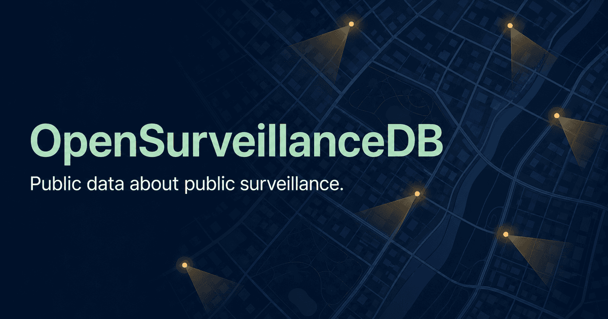

<picture>
  <source media="(prefers-color-scheme: dark)" srcset="public/logo-dark.svg">
  
</picture>

# OpenSurveillanceDB

*An open, non-commercial civic database of visible public surveillance infrastructure.*

[](https://github.com/Syax89/open-surveillance-db/actions/workflows/ci.yml)
[](LICENSE)
[](docs/data-sources/README.md)



## About

OpenSurveillanceDB is an open, non-commercial civic database that documents
**visible public surveillance infrastructure**. It maps where cameras and
automated surveillance systems are installed in shared spaces, so the public
can understand what observes them.

It is not a tool for watching, tracking or bypassing lawful surveillance: the
project publishes **data about cameras, not feeds** — context, not profiles;
transparency, not tracking.

## Mission

> Help people understand the systems around them.

The project maps visible camera infrastructure in shared spaces, so the public
can see what is installed nearby. It documents public-facing equipment only.
It is not a tool for watching, tracking or bypassing lawful surveillance.

| What we document | What we do not collect | What the data cannot prove |
| --- | --- | --- |
| Visible camera infrastructure, approximate location, type, source and a community status. | Camera feeds, credentials, private-home details, operational weaknesses, faces, licence plates or other personal data. | An absent record does not show that an area is free of surveillance. It only shows that no record is currently published there. |

## Principles

Five commitments shape every decision in this project, from the data model to
the community actions.

- **Free to use** — no ads, no profiling, no paid features. The database and
  the software are public goods.
- **Open source** — the software can be inspected, reused and improved by the
  community.
- **Open data with provenance** — licensing and provenance are recorded for
  every published record, so journalism, research and civic use can rely on
  them.
- **Privacy and safety by design** — no private-home cameras, no sensitive
  operational details, no live-feed links. Faces and licence plates are
  removed before publication.
- **Community accuracy first** — reports are published immediately from
  verified accounts. The community keeps the directory accurate: confirming
  what is still there, flagging what is gone, and withdrawing what is
  problematic — under automatic, transparent thresholds.

## What we deliberately do not do

The boundaries are as important as the mission. OpenSurveillanceDB will never
become any of the following:

- **No camera feeds** — we document equipment, not footage. No live or
  recorded feed is ever linked or displayed.
- **No tracking tools** — the data cannot be used to watch, follow or profile
  people in public space.
- **No evasion advice** — the project does not help anyone avoid lawful
  surveillance and does not publish operational weaknesses.
- **No private property** — cameras that surveil private homes, and details of
  private life, are out of scope.

## Features

- **Interactive map** (`/mappa`): OpenStreetMap tiles served through a
  same-origin proxy, viewport-first rendering, native grid aggregation at
  national zoom, camera field-of-view cones/circles above zoom 16, a
  keyboard-accessible marker popup with community actions.
- **Public directory** (`/directory`): text equivalent of the map — search,
  filters, A–Z index, CSV/GeoJSON exports, `?page=` pagination.
- **Record pages** (`/records/[id]`): facts, location (address + coordinates),
  community status, a small interactive position map, a public event timeline,
  and an owner-only edit page.
- **Community contributions** (`/segnala`, `/correggi`): verified accounts
  submit cameras or corrections with map/coordinate location selection,
  reverse-geocode address prefill and a server-enforced duplicate gate.
  Community actions (useful / confirm / no longer there / problem / privacy)
  drive automatic, trust-weighted state transitions (ADR 0021).
- **Accounts and auth**: email+password with verification, passkeys
  (WebAuthn), and GitHub/Google OIDC sign-in — server-gated on configured
  providers; self-service erasure with de-attribution (GDPR art. 17).
- **Public API**: `/api/cameras` (JSON/GeoJSON/CSV), search, nearby, per-record
  actions and events, tile and geocode proxies — documented on the built-in
  `/api-docs` page, with a fail-open worker cache for public reads.
- **Import pipeline**: official open-data sources (city/regional/government
  portals, OpenStreetMap) via `scripts/import/` — per-source adapters, a
  fail-closed licence gate, cross-source dedup, idempotency and per-batch
  attribution on the `/fonti` page.
- **Bilingual interface**: English and Italian, with structural parity
  enforced at compile time (ADR 0007).

## Quick start

Requirements: Node.js 22.13 or newer.

```bash
npm install
npm run db:migrate   # apply the Drizzle schema migrations to a fresh local DB
npm run dev          # vinext dev server on http://localhost:3000
```

Open `http://localhost:3000`. The database starts empty — no rows are inserted
at runtime. Two labelled illustrative pins for manual checks:

```bash
npm run db:seed
```

Useful commands:

```bash
npm run db:reset      # non-destructive local reset (moves state aside, re-migrates)
npm run db:generate   # regenerate a migration after changing db/schema.ts
npm run test          # build + full test suite
npm run lint
npm run build         # production build (dist/)
npm run db:provision  # provision real moderator/admin accounts
```

Local environment variables go in `.dev.vars` (copy `.env.example`, gitignored
— see `worker-configuration.d.ts` for every variable). The local moderation
surface lives at `http://localhost:3000/moderation` and fails closed (503)
until credentials are configured (ADR 0003).

For a complete walkthrough — prerequisites, migrations, synthetic fixtures,
safe reset — read [docs/DEVELOPMENT_SETUP.md](docs/DEVELOPMENT_SETUP.md).

## Project structure

```
app/        Next.js application (App Router): routes, components, i18n bundles,
            API route handlers (app/api), SSR pages
db/         Drizzle schema + data access layer (cameras, auth, moderation,
            community actions, imports, geocoding)
worker/     Cloudflare Worker entry (server runtime wiring)
drizzle/    SQL migrations (numbered, applied with wrangler d1)
scripts/    Tooling: import pipeline (scripts/import), DB helpers, preview
            servers, benchmarks, coverage
tests/      Node test suite (build + node --test), harnesses in tests/helpers
docs/       Project documentation (see index below)
ops/        Operator tooling (secrets vault helpers, etc.)
public/     Static assets (logo, favicon, og image)
```

## Documentation

- [docs/DOCUMENTATION_INDEX.md](docs/DOCUMENTATION_INDEX.md) — complete inventory of the documentation (purpose, status, language)
- [docs/DEVELOPMENT_SETUP.md](docs/DEVELOPMENT_SETUP.md) — clean local setup, migrations, fixtures
- [docs/LOCAL_PLAYBOOK.md](docs/LOCAL_PLAYBOOK.md) — end-to-end local workflow with fictional data
- [docs/ARCHITECTURE.md](docs/ARCHITECTURE.md) — architecture and security boundaries
- [docs/DATA_MODEL.md](docs/DATA_MODEL.md) — data model, status lifecycle (ADR 0021)
- [docs/DATA_DICTIONARY.md](docs/DATA_DICTIONARY.md) — every public field
- [docs/FRONTEND_DESIGN.md](docs/FRONTEND_DESIGN.md) + [docs/design/](docs/design/README.md) — design system (normative + current patterns)
- [docs/roadmap.md](docs/roadmap.md) — current status and direction
- [docs/decisions/](docs/decisions/README.md) — architecture decision records (ADR 0001–0021)
- [docs/data-sources/](docs/data-sources/README.md) — public data sources, licences, import pipeline
- [docs/OSM_INTEGRATION.md](docs/OSM_INTEGRATION.md) — tile proxy and geocoder
- [docs/DEPLOYMENT.md](docs/DEPLOYMENT.md) — deployment and operations
- [docs/SITEMAP.md](docs/SITEMAP.md) — routes and information architecture
- [docs/ACCESSIBILITY_STATEMENT.md](docs/ACCESSIBILITY_STATEMENT.md) — WCAG 2.2 AA conformance
- [docs/legal/](docs/legal/README.md) — legal deliverables (privacy notice, terms, retention)
- [CHANGELOG.md](CHANGELOG.md) — release history

## Data sources and licensing

The public dataset and every export format (JSON, CSV, GeoJSON) are licensed
under **ODbL 1.0** (ADR 0008); published coordinates are rounded to ~4 decimal
places (~10 m) by default. Records come from community reports and from
official open-data imports (city, regional and government sources across
Europe and North America), each with its own source licence and per-batch
attribution. The full registry lives in
[docs/data-sources/](docs/data-sources/README.md), and the live attribution
table is on the `/fonti` page.

Application source code: [GNU AGPL v3.0 or later](LICENSE).
Documentation: CC BY-SA 4.0 (proposed). See
[docs/OPEN_SOURCE.md](docs/OPEN_SOURCE.md).

## Contributing

Contributions, criticism, translations, accessibility reviews and local
knowledge are welcome. Please read [CONTRIBUTING.md](CONTRIBUTING.md),
[CODE_OF_CONDUCT.md](CODE_OF_CONDUCT.md), [GOVERNANCE.md](GOVERNANCE.md) and
[SECURITY.md](SECURITY.md) before participating. Material decisions are
recorded as ADRs in [docs/decisions/](docs/decisions/README.md).

## Project and contact

OpenSurveillanceDB is a **personal open-source project** owned and
maintained by **Simone Rondina** (GitHub:
[Syax89](https://github.com/Syax89)). For any concern — privacy,
data-protection, security disclosure, corrections or anything else — write
to **privacy@opensurveillancedb.org**.
