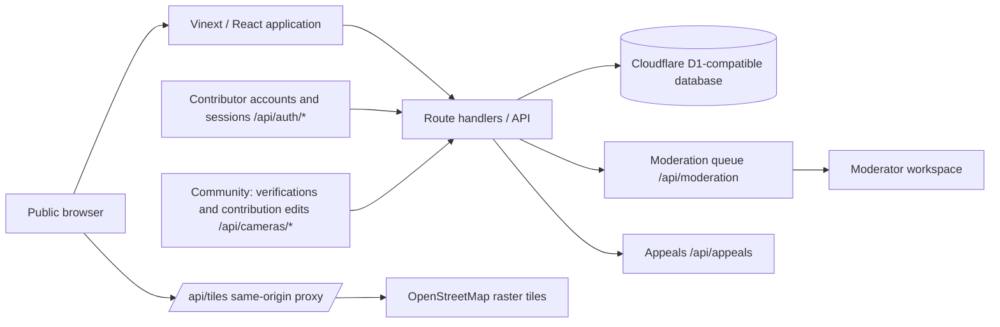
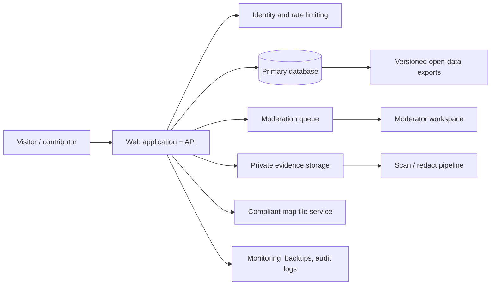

# Architecture

Last reviewed: 2026-08-02

## Current prototype

The front end is a React/Vinext application. Leaflet renders a map whose
tiles are served exclusively through the same-origin proxy
`/api/tiles/{z}/{x}/{y}.png` (the client never hotlinks a tile server
directly): the route validates zoom/coordinates, forwards the upstream
request with an identifying User-Agent and the end user's Referer, caches
responses server-side, and honours the OSMF tile usage policy (see
docs/OSM_INTEGRATION.md). The `/api/cameras` endpoint exposes only `verified`
and `demo` records; submissions are created with `pending` status. `GET
/api/cameras` accepts optional `kind` (bounded, parameterised equality) and
`freshness` (whitelisted `7d`/`30d`/`90d` windows) filters shared by the
JSON, GeoJSON, and CSV outputs; a freshness window matches only ISO
verification timestamps, so illustrative demo labels and pre-backfill prose
can never be presented as freshly verified.

Contributor accounts and sessions (ADR 0013) live under `/api/auth/*`:
register, login, logout, `me`, `me/submissions`, and account erasure.
Passwords are hashed with salted PBKDF2-HMAC-SHA256 (210,000 iterations);
sessions are opaque 32-byte tokens stored only as their SHA-256, with a
per-session CSRF token (double-submit) and rate-limited credential
endpoints. Coarse roles — `contributor`, `moderator`, `admin` — gate every
protected route through `requireRole` in `app/lib/authz.ts` (ADR 0014):
`moderator+` reads/writes the moderation queue and appeals,
`contributor+` may file an appeal, and anonymous submissions stay possible
by design. The moderation queue (`/api/moderation`) and appeals
(`/api/appeals`) are separate protected surfaces with an append-only audit
trail in `moderation_events`. The database layer is designed for Cloudflare D1 and uses
Drizzle for schema migrations.

The community system (ADR 0018) runs on the same prototype: contributors can
verify a public record (`PUT /api/cameras/[id]/confirmation`, with a
structural anti-gaming layer — one active verification per (record,
contributor), plus daily and per-record quotas), see their own verification
state (`GET`, `DELETE` for the toggle), and edit records on two tracks
(`PATCH /api/cameras/[id]`): pending records get a direct owner-only update,
while published records never mutate `cameras` directly — the PATCH inserts
a `camera_edit_requests` diff row plus a `moderation_queue` row (entity
`camera_edit`) that a moderator applies or discards later. Trust levels
(L0–L4) are derived server-side from the contributor's verified-contribution
count and returned by the profile endpoints. Submissions additionally pass
the pre-submit duplicate gate (ADR 0019): `POST /api/cameras` runs the
nearby-duplicate check before storage and answers `409 Conflict` with
`possibleDuplicates` when a `high`-strength candidate exists, unless the
payload carries `duplicateConfirmed: true`.

## Required production shape

## Boundaries

- **Public map:** reviewed, intentionally limited location and metadata only.
- **Moderation system:** pending records, optional `manufacturer` and
  `observedOn` metadata, reviewer notes, rationale, timestamps, and
  appeals; never exposed as a public feed. A moderator decides separately
  whether optional metadata may be included in a verified public record. The
  `publishManufacturer` and `publishObservedOn` choices default to false and
  are enforced independently at the public-data query boundary.
- **Evidence storage:** photo upload was removed entirely on 2026-08-08
  (CEO decision): no media intake exists in the current model — records are
  text metadata only, so there is no evidence object store, no storage key
  and no media serving surface to protect. Existing R2 objects from the
  retired feature were retained (no deletion).
- **Data export:** reviewed public data only, with a version and license notice.
- **Observability:** aggregate service health and security events; avoid logging submitted personal data unnecessarily.

## Technology choices

| Concern | Prototype choice | Production requirement |
| --- | --- | --- |
| UI | React + Vinext | Accessible, internationalised web UI |
| Map | Leaflet + same-origin tile proxy (`/api/tiles` → OSM, policy-compliant) | Provider-compliant tiles or self-hosted vector/raster stack |
| Database | Cloudflare D1 + Drizzle | Backups, migration discipline, access controls, retention plan |
| API | Route handlers + JSON/GeoJSON | Versioning, rate limits, schema validation, documentation |
| Media | **None — photo upload removed (2026-08-08, CEO):** no image is accepted or stored; records are text metadata only (existing R2 objects retained, no deletion) | Not applicable — no media processing, storage or serving in the current model |
| Identity | Contributor accounts (email+password, PBKDF2-SHA256, session tokens stored hashed, CSRF double-submit) and roles contributor/moderator/admin enforced via `requireRole` on protected routes — ADR 0013/0014 | Minimal accounts, anti-abuse controls, contributor privacy |

## Security design principles

- Default deny: pending records and evidence never reach public endpoints.
- Minimise data: collect only fields necessary for a civic record.
- Separate duties: contributors cannot approve their own reports; moderators have scoped roles.
- Preserve accountability: log high-impact moderation and administrative changes.
- Design for deletion and correction from the first production schema.
