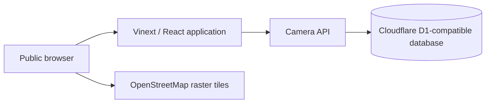
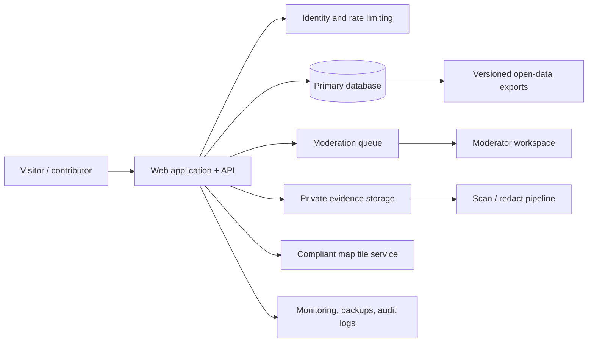

# Architecture

## Current prototype

The front end is a React/Vinext application. Leaflet renders a map using OpenStreetMap tiles in local development. The `/api/cameras` endpoint exposes only `verified` and `demo` records; submissions are created with `pending` status. `GET /api/cameras` accepts optional `kind` (bounded, parameterised equality) and `freshness` (whitelisted `7d`/`30d`/`90d` windows) filters shared by the JSON, GeoJSON, and CSV outputs; a freshness window matches only ISO verification timestamps, so illustrative demo labels and pre-backfill prose can never be presented as freshly verified. The database layer is designed for Cloudflare D1 and uses Drizzle for schema migrations.

## Required production shape

## Boundaries

- **Public map:** reviewed, intentionally limited location and metadata only.
- **Moderation system:** pending records, optional `manufacturer` and
  `observedOn` metadata, reviewer notes, rationale, timestamps, and
  appeals; never exposed as a public feed. A moderator decides separately
  whether optional metadata may be included in a verified public record. The
  `publishManufacturer` and `publishObservedOn` choices default to false and
  are enforced independently at the public-data query boundary.
- **Evidence storage:** separate from public records; least-privilege access; retention and deletion rules required. Photo uploads go to R2 (`PHOTOS` bucket) with metadata-only rows in D1; `storage_key` is never returned by any API and the moderator preview is served only under the `/api/moderation/*` auth gate. Public photo serving is strictly fail-closed: bytes are returned only for approved photos with confirmed redaction linked to a currently public camera; everything else answers 404 with no existence leak.
- **Data export:** reviewed public data only, with a version and license notice.
- **Observability:** aggregate service health and security events; avoid logging submitted personal data unnecessarily.

## Technology choices

| Concern | Prototype choice | Production requirement |
| --- | --- | --- |
| UI | React + Vinext | Accessible, internationalised web UI |
| Map | Leaflet + OSM raster tiles | Provider-compliant tiles or self-hosted vector/raster stack |
| Database | Cloudflare D1 + Drizzle | Backups, migration discipline, access controls, retention plan |
| API | Route handlers + JSON/GeoJSON | Versioning, rate limits, schema validation, documentation |
| Media | Photo evidence intake: R2 object storage + D1 metadata, mandatory EXIF strip, moderation gate | Isolated object storage, scanning/redaction, signed access |
| Identity | Not implemented | Minimal accounts, anti-abuse controls, contributor privacy |

## Security design principles

- Default deny: pending records and evidence never reach public endpoints.
- Minimise data: collect only fields necessary for a civic record.
- Separate duties: contributors cannot approve their own reports; moderators have scoped roles.
- Preserve accountability: log high-impact moderation and administrative changes.
- Design for deletion and correction from the first production schema.
