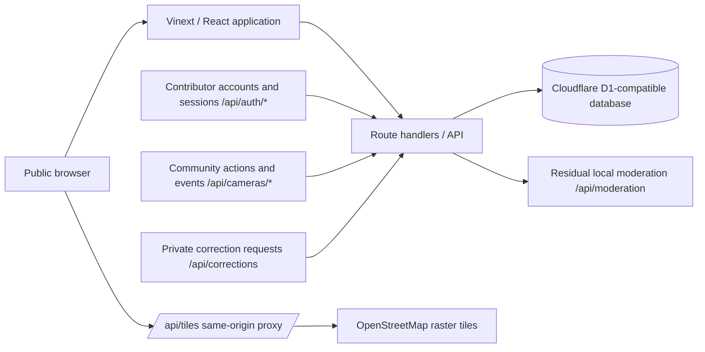

# Architecture

Last reviewed: 2026-08-08

## Current architecture

The front end is a React/Vinext application. Leaflet renders a map whose
tiles are served exclusively through the same-origin proxy
`/api/tiles/{z}/{x}/{y}.png` (the client never hotlinks a tile server
directly): the route validates zoom/coordinates, forwards the upstream
request with an identifying User-Agent and the end user's Referer, caches
responses server-side, and honours the OSMF tile usage policy (see
docs/OSM_INTEGRATION.md). The `/api/cameras` endpoint exposes only `active`
and `demo` records (ADR 0021; the legacy `verified` status was retired by
migration 0039 and public surfaces derive their whitelist from
`PUBLIC_CAMERA_STATUSES` in `app/lib/public-status.ts`). Verified-account
submissions are published as `active` immediately (community model, ADR
0021); the legacy `pending` intake path survives only for the residual
legal-emergency moderation flows. `GET /api/cameras` accepts optional `kind`
(bounded, parameterised equality) and `freshness` (whitelisted
`7d`/`30d`/`90d` windows) filters shared by the JSON, GeoJSON, and CSV
outputs.

Contributor accounts and sessions (ADR 0013) live under `/api/auth/*`:
register, login, logout, `me`, `me/contributions`, passkey enrollment and
login, OIDC start/callback, and account erasure. Passwords are hashed with
salted PBKDF2-HMAC-SHA256 (100,000 iterations for new accounts, the Cloudflare
Workers WebCrypto ceiling); sessions are opaque 32-byte
tokens stored only as their SHA-256, with a per-session CSRF token
(double-submit) and rate-limited credential endpoints. Coarse roles —
`contributor`, `moderator`, `admin` — gate every protected route through
`requireRole` in `app/lib/authz.ts` (ADR 0014). A **verified contributor
account is required to submit reports or corrections** (ADR 0020 write gate);
browsing the public data never requires an account.

The community system (ADR 0021) runs on the same stack: verified contributors
cast community actions (`useful` / `confirm` / `gone` / `problem` / `privacy`)
via `PUT/DELETE /api/cameras/[id]/actions` (one active action per
(record, contributor), anti-gaming quotas), trust-weighted thresholds trigger
automatic state transitions (`active → hidden/removed`, reversible by
contrary consensus), and every transition is recorded as an unattributed
event in the public per-record timeline (`camera_lifecycle_events`, served by
`/api/cameras/[id]/events`). Correction and takedown requests are a private,
human-reviewed channel (`/api/corrections`, `correction_requests`). The
moderation surface (`/api/moderation`) is a residual local tool for
legal-emergency flows only (ADR 0021 §8), gated by
`MODERATION_USER`/`MODERATION_PASSWORD`/`MODERATION_TOKEN` credentials —
fail-closed, returning `503` when none are configured (ADR 0003). The appeal
workflow (ADR 0014) is retired in the community model (ADR 0021 §7.3).

Submissions pass the pre-submit duplicate gate (ADR 0019): `POST
/api/cameras` runs the nearby-duplicate check before storage and answers
`409 Conflict` with `possibleDuplicates` when a `high`-strength candidate
exists, unless the payload carries `duplicateConfirmed: true`. Edits to
published records go through the two-track `PATCH /api/cameras/[id]`:
`pending` records get a direct owner-only update, published records become a
moderator-approved edit request (`camera_edit_requests` + `moderation_queue`
entity `camera_edit`). Trust levels (L0–L4) are derived server-side from the
contributor's verified-contribution count (ADR 0021 §4).

Public reads are cached in the worker with a fail-open Cache API wrapper
(`app/lib/public-cache.ts`, `X-OSDB-Cache` header) and, on Cloudflare, served
from D1 read replicas; only HTTP 200 responses are stored and the cache can
never take a route down.

## Boundaries

- **Public map:** `active`/`demo` records with intentionally limited location
  and metadata only. Withdrawn records (`hidden`/`removed`) are reachable by
  direct link with an explicit banner, but never listed, and their detail
  payload is a privacy tombstone (no address, coordinates, description or
  manufacturer).
- **Moderation/corrections:** pending intake, edit requests, correction
  requests and audit trails are never exposed as a public feed.
- **Evidence storage:** no media intake exists in the current model — records
  are text metadata only (photo upload was removed entirely on 2026-08-08,
  CEO decision), so there is no evidence object store, no storage key and no
  media serving surface to protect. Existing R2 objects from the retired
  feature were retained (no deletion).
- **Data export:** public data only, with an ODbL 1.0 notice; coordinates
  rounded to ~4 decimal places by default (ADR 0008).
- **Observability:** aggregate service health and security events; avoid
  logging submitted personal data unnecessarily.

## Technology choices

| Concern | Current choice | Production notes |
| --- | --- | --- |
| UI | React + Vinext (Next.js App Router on Vite) | Accessible, internationalised web UI |
| Map | Leaflet + same-origin tile proxy (`/api/tiles` → OSM, policy-compliant, configurable provider) | Provider-compliant tiles or self-hosted vector/raster stack |
| Database | Cloudflare D1 + Drizzle (migrations in `drizzle/`) | Backups, migration discipline, access controls, retention plan |
| API | Route handlers + JSON/GeoJSON/CSV | Versioning, rate limits (in-memory + edge binding), schema validation, `/api-docs` |
| Media | **None — photo upload removed (2026-08-08, CEO):** records are text metadata only | Not applicable |
| Identity | Contributor accounts (email+password, PBKDF2-SHA256, hashed session tokens, CSRF double-submit), passkeys (WebAuthn), GitHub/Google OIDC (server-gated), roles contributor/moderator/admin via `requireRole` — ADR 0013/0014/0020 | Minimal accounts, anti-abuse controls, contributor privacy |

## Security design principles

- Default deny: non-public records and private requests never reach public
  endpoints.
- Minimise data: collect only fields necessary for a civic record.
- Separate duties: contributors cannot approve their own edits; moderators
  have scoped roles; the acting reviewer is derived server-side.
- Preserve accountability: log high-impact moderation and administrative
  changes.
- Design for deletion and correction from the first production schema.
