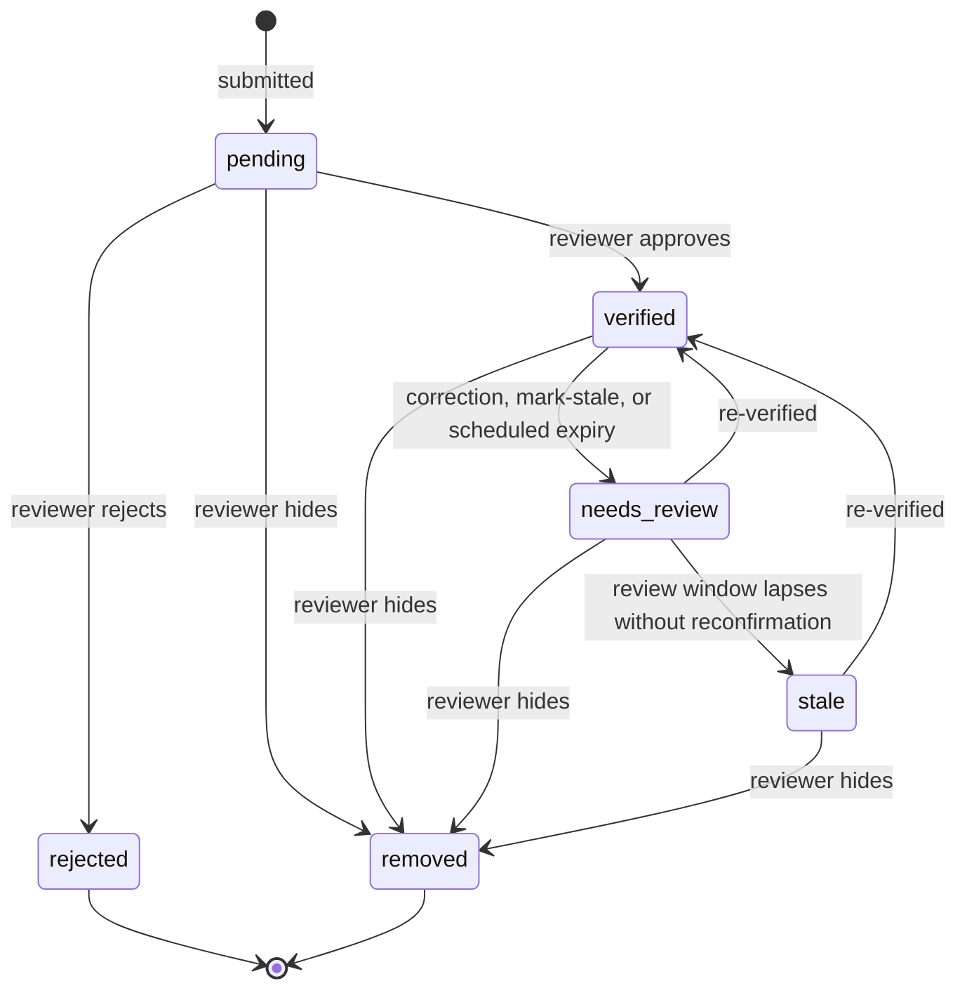
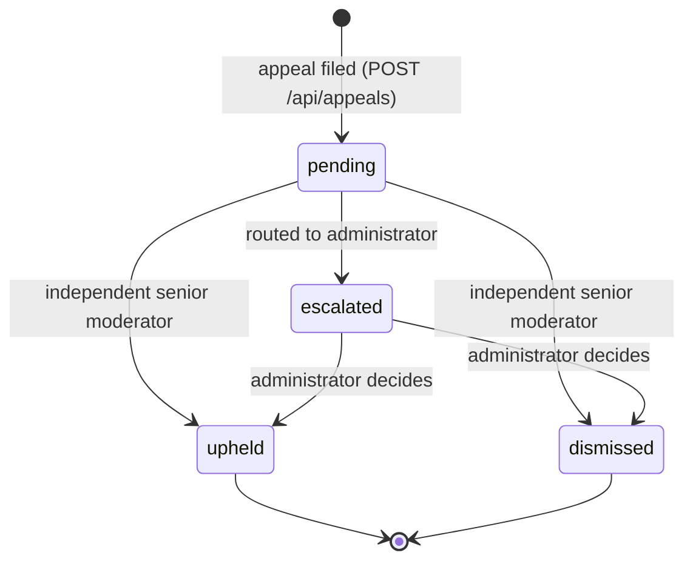
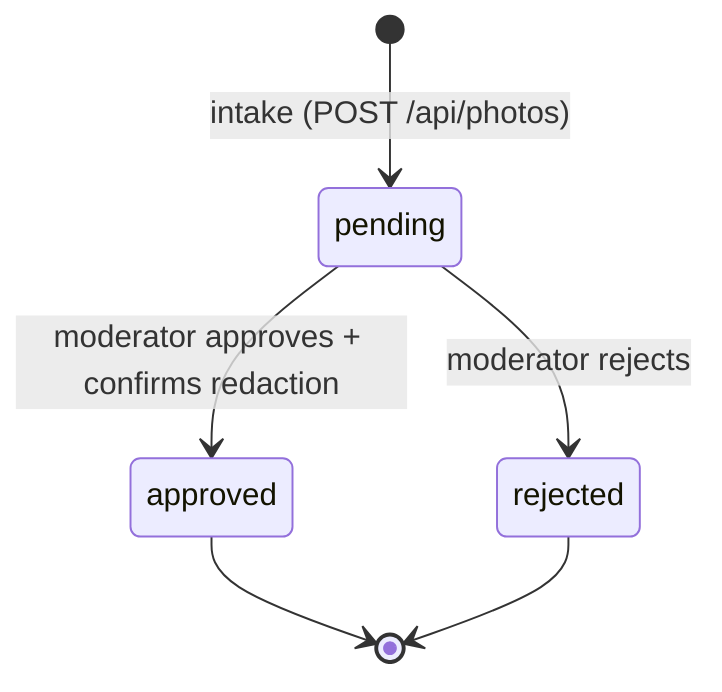

# Data model and API

> Field-by-field public reference: see the
> [data dictionary](DATA_DICTIONARY.md). Export releases: see the
> [export versioning policy](EXPORT_VERSIONING.md). Schema history: Drizzle
> migrations [`drizzle/`](../drizzle) (`0000`–`0011`), one per incremental
> change, with the live schema in [`db/schema.ts`](../db/schema.ts).

## Public camera record

| Field | Public? | Description |
| --- | --- | --- |
| `id` | Yes | Stable record identifier |
| `title` | Yes | Plain-language label; no personal names |
| `kind` | Yes | Camera category, for example fixed dome or traffic monitoring |
| `latitude`, `longitude` | Yes, rounded to ~4 decimal places (~10 m) by default | Location of publicly visible infrastructure |
| `address` | Usually | General location text, not a private address |
| `description` | Yes after review | Brief factual context, without sensitive operational detail |
| `manufacturer` | Only with a field-specific opt-in | Optional maker/brand supplied with a report; stays private unless a moderator explicitly elects to publish this field |
| `observedOn` | Only with a field-specific opt-in | Optional ISO calendar date of the observation; stays private unless a moderator explicitly elects to publish this field |
| `source` | Yes | Provenance type such as survey, official source, or demo |
| `updated` | Yes | Last public verification date (ISO 8601); freshness windows match only ISO values — illustrative demo labels are never window-matched |
| `status` | Yes in controlled form | `verified` or `demo`; `pending` is never public |

## Report metadata and publication choices (implemented)

The fields formerly listed as "planned for moderated storage" exist today in the
[`cameras` table](#cameras) (`db/schema.ts`):

- **Optional report metadata**: `manufacturer` and `observedOn`. Intake
  normalises the manufacturer text and accepts the observation date only in a
  valid calendar-date form. Both fields belong to the private pending report
  first; neither is made public merely because it was submitted or because the
  camera record is approved.
- **Per-field publication choices**: `publishManufacturer` and
  `publishObservedOn` default to `false`. A moderator makes each choice
  independently during a camera decision. The public query and every export
  suppress the underlying value unless its own flag is `true`.
- **Submission attribution**: `contributorId` links the report to the
  authenticated contributor who submitted it (ADR 0013). Anonymous submissions
  remain possible and leave the link `NULL`.
- **Review decision trail**: the append-only [`moderationEvents`](#moderationevents)
  table records reviewer, reason code, decision time, and status change per
  decision.
- **Correction/takedown requests**: the [`correctionRequests`](#correctionrequests)
  table holds requests and their resolution state.
- **Evidence references**: the [`photos`](#photos) table holds photo metadata
  (bytes live in object storage, never in D1).
- **Change history**: public, per-record revision history served by
  `GET /api/cameras/revisions`.

## Status lifecycle

### Camera records

Only `verified` records are eligible for real public publication. `demo` is
reserved for fictional, clearly labelled prototype content. A record is only
published as *current* while it is inside its freshness window
(`last_verified_at` + `review_interval_months`); the scheduled recheck date is
`review_due_at`, and a window that lapses without reconfirmation moves the
record to `needs_review`.

When a moderator approves a report, approval is not a blanket publication of
every submitted field. Optional `manufacturer` and `observedOn` metadata each
have an independent publication choice, defaulting to private. A moderator
sets `publishManufacturer` and/or `publishObservedOn` only after confirming
the individual value is sufficiently accurate, relevant, and safe under the
applicable data-minimisation policy. A false flag suppresses the raw value from
JSON, CSV, GeoJSON, map, directory, and record-detail output.

### Appeals (ADR 0014)

A contributor who disagrees with a final moderation decision may contest it:

An *upheld* appeal reverses the decision: the entity returns to the moderation
queue for a fresh decision by a different reviewer (it never publishes
anything by itself). A *dismissed* appeal leaves the original decision
standing. An *escalated* appeal may only be resolved by the administrator.
Every transition writes an append-only `moderation_events` row
(`appeal-filed | appeal-uphold | appeal-dismiss | appeal-escalate`) linked via
`appeal_id`; appeal events are internal workflow and never appear in the
public revision history.

### Photo pipeline (2026-08)

Photos are evidence, never public by default:

Intake is fail-closed: size/MIME/dimension limits, magic-byte container
verification, mandatory EXIF/XMP/IPTC stripping, sanitised bytes in object
storage (R2, `PHOTOS`) with metadata only in D1. A photo is served publicly
only when it is `approved`, `redaction_confirmed` is set, and the linked
camera is itself public and current. Pending or rejected evidence never leaks
through the public routes.

## API endpoints

All routes live under `app/api/`. Public reads share rate-limit buckets
(plain read vs. bulk export vs. dedicated per-route buckets); submissions,
auth, and moderation have their own stricter limits. Input limits reject
oversized URLs (`414`) and bodies (`413`), and every state-changing route
enforces same-origin + CSRF when a session is present.

| Method | Route | Auth | Behaviour |
| --- | --- | --- | --- |
| `GET` | `/api/cameras` | public | Public `verified` + `demo` records. Filters: `kind` (exact text), `freshness` (`7d` \| `30d` \| `90d` \| `all`), `format` (`json` default, `csv`, `geojson` with `Content-Disposition` download) |
| `POST` | `/api/cameras` | public (attribution optional) | Normalises optional `manufacturer`, validates optional `observedOn` (`YYYY-MM-DD`), creates a private `pending` report. Rate-limited; with a live session the report is attributed to the contributor and the request must pass same-origin + CSRF |
| `GET` | `/api/cameras/nearby` | public | Pre-submit duplicate check: `latitude`/`longitude` (required), `radius` 10–500 m (default 75), optional `title`/`address`/`kind` hints used for similarity ranking. Returns public records with `distanceMeters` |
| `GET` | `/api/cameras/search` | public | Locality/address/coordinates search. Raw coordinate pairs use a fixed radius; other text resolves through the Nominatim geocoder to a place + bounding-box radius. Response carries the resolved area and a truthful zero-result state |
| `GET` | `/api/cameras/revisions` | public | Public change history for one public record (`cameraId` required). Serves only currently-public records; internal workflow events (appeals, recusals, escalations) are filtered out |
| `POST` | `/api/corrections` | public | Correction/takedown request: `cameraId` (optional), `issueType`, `message`, `contact`. Returns `201 { referenceId }`; requests never alter a public record automatically |
| `POST` | `/api/auth/register` | public | Contributor account (email + password, PBKDF2-SHA256, ADR 0013). Sets `osdb_session` (HttpOnly) + `osdb_csrf` cookies |
| `POST` | `/api/auth/login` | public | Verify credentials and open a session (same cookie pair). Unknown email and wrong password both answer `401` |
| `POST` | `/api/auth/logout` | session | Revoke the current session and clear cookies; idempotent |
| `GET` | `/api/auth/me` | session | Current contributor profile (never the password hash); `401` anonymous |
| `GET` | `/api/auth/me/submissions` | session | The contributor's own attributed reports (id, title, status, created_at); `401` anonymous |
| `DELETE` | `/api/auth/account` | session | Account erasure (GDPR art. 17, RETENTION_SCHEDULE R7): de-attributes every attributed report, revokes all sessions, hard-deletes the contributor row; returns the count of de-attributed reports |
| `POST` | `/api/appeals` | contributor+ | File an appeal against a *final* moderation decision (`entity`, `entityId`, `decisionEventId`, `reason` ≤ 1500 chars). One pending appeal per decision (`409`); every step writes an audit event |
| `GET` | `/api/appeals` | moderator+ | List filed appeals (appellant display name, contested decision, status) |
| `PATCH` | `/api/appeals/:id` | moderator+ | Decide a pending appeal: `uphold` \| `dismiss` \| `escalate`. Decider must be a senior moderator who did not make the original decision; escalated appeals resolve only at the administrator |
| `GET` | `/api/moderation` | moderator+ | Pending moderation queue (cameras, corrections, photos), ordered by recency |
| `PATCH` | `/api/moderation` | moderator+ | Decide an entity. Camera actions: `approve`, `reject`, `hide`, `mark-stale`, `reverify`, `escalate`. Correction actions: `approve`, `reject`, `associate`, `escalate`. Photo actions: `approve` (requires `redactionConfirmed: true`), `reject`. Acting reviewer is derived server-side from the authenticated user's linked reviewer profile (ADR 0014) |
| `GET` | `/api/moderation/photos/:id` | moderator+ (edge gate) | Moderator preview of a photo's bytes before deciding; pending/rejected photos are never served by the public route |
| `POST` | `/api/photos` | public | Photo intake: raw image body, size/MIME/dimension caps, magic-byte verification, mandatory EXIF/XMP/IPTC strip, bytes → R2, metadata → D1. Returns photo metadata, never the storage key or bytes |
| `GET` | `/api/photos?cameraId=N` | public | Approved, redaction-confirmed photos of a public camera (record-detail gallery); `404` when the camera is not public |
| `GET` | `/api/photos/:id` | public | Serve one approved photo (bytes only when approved + redaction confirmed + linked camera public and current); otherwise fail-closed `404` |
| `GET` | `/api/tiles/:z/:x/:y` | public | Same-origin OSMF-compliant tile proxy: stable User-Agent, Referer forwarded, server-side caching honouring upstream headers, strict zoom/x/y validation. Provider switchable via `TILE_PROVIDER_URL` / `TILE_PROVIDER_KEY` |

The POST routes are no longer prototype-only: they carry rate limiting, input
limits, optional authenticated attribution with CSRF protection, and (for
photos) the full intake pipeline described above. The reviewer interface is
the `/api/moderation` queue gated by coarse roles; the worker edge Basic/Bearer
gate remains the transport-level login for the moderation dashboard.

## Tables

Ten tables in D1, defined in [`db/schema.ts`](../db/schema.ts) and built up by
migrations [`drizzle/0000`–`0011`](../drizzle). All timestamps are ISO 8601
text. See the [data dictionary](DATA_DICTIONARY.md) for the public projection
of `cameras` and the input contract of the submission routes.

### `cameras`

The public record plus moderation state. Public projection: `id`, `title`,
`kind`, `manufacturer`/`observedOn` (conditional on the publish flags),
`address`, `description`, `latitude`, `longitude`, `source`, `updated`,
`status`, `createdAt`. Private columns: `notes` (intake notes, never public),
`publishManufacturer`, `publishObservedOn`, freshness state
(`lastVerifiedAt`, `reviewDueAt`, `reviewIntervalMonths`), and `contributorId`
→ `contributors.id` (nullable: anonymous reports).

### `correctionRequests`

Correction/takedown requests: `cameraId` (optional link), `issueType`,
`message`, `contact`, `status` (`pending`), `outcome`, `createdAt`. Never
public; callers only receive the opaque `referenceId`.

### `contributors`

Public credential store (ADR 0013). `email` (lowercase, unique),
`displayName` (optional public handle), `passwordHash`
(`pbkdf2$<iterations>$<saltB64>$<hashB64>`, PBKDF2-SHA256 at 210,000
iterations), timestamps. Anonymous submissions remain possible by design.

### `sessions`

Login sessions (ADR 0013). Only the SHA-256 of the raw token is stored
(`tokenHash`, unique), plus a per-session `csrfToken` echoed through a
non-HttpOnly cookie and verified on state-changing requests. `contributorId`
→ `contributors.id` (cascade delete), `expiresAt`, `revokedAt` (set on
logout).

### `users`

Coarse role identity (ADR 0014): `email` (unique), `displayName`, `role`
(`contributor` | `moderator` | `admin`), `active`, `mfaEnabled`, timestamps.
Gates every protected route via `requireRole`. The six "Demo" rows are
local-prototype seed (migration `0010`) and are replaced by provisioned
accounts before public alpha. Bridged to `contributors` by email at
provisioning time (see ADR 0014 integration note).

### `reviewers`

Named moderators with the granular DATA_TRUST role: `displayName` (unique),
`role` (e.g. `intake_reviewer`, `record_reviewer`, `senior_moderator`,
`administrator`), `active`, `mfaEnabled`, `userId` → `users.id` (optional
link). The moderation PATCH derives the acting reviewer server-side from the
authenticated user's linked reviewer row.

### `moderationQueue`

Per-entity workflow state (one open row per entity): `entity` + `entityId`,
`state` (default `queued`; a row is closed before a new one can open),
`assigneeId` → `reviewers.id`, `sensitivity` (`standard` | `sensitive` |
`urgent`), `requiresSecondReview`, `secondReviewerId`,
`escalationReason`, timestamps. `cameras.status` stays the domain/public
state; this table tracks assignment, sensitivity, second review, and
escalation.

### `moderationAppeals`

Contributor appeals (ADR 0014): `entity` + `entityId`,
`decisionEventId` → `moderationEvents.id` (the contested final decision),
`appellantId` → `users.id`, `reason`, `status` (`pending` → `upheld` |
`dismissed` | `escalated`), `decidedBy` → `reviewers.id`, `decisionNote`,
`decidedAt`. One pending appeal per decision (partial unique constraint in the
migration).

### `moderationEvents`

Append-only audit trail for moderation and appeals. `entity` + `entityId`,
`previousStatus`, `newStatus`, `action`, `reasonCode`, `note`, `actor`,
`reviewerId` → `reviewers.id`, `actorRole`, `recused`, `escalated`,
`secondReviewerId`, `appealId` (→ `moderation_appeals.id`), `createdAt`.
UPDATE/DELETE are blocked at the database layer (triggers in migration
`0008`); the API exposes no way to mutate history.

### `photos`

Photo evidence metadata (bytes live in R2 bucket `PHOTOS` under an opaque
`storageKey` never exposed to clients). `cameraId`, `contributorId`, `mimeType`,
`width`, `height`, `sizeBytes`, `status` (`pending` → `approved` | `rejected`),
`exifStripped` (mandatory intake strip), `redactionConfirmed` (set by the
moderator at approval time), timestamps.

## Local report-location selection

The local report form accepts a position chosen by clicking the map or by
entering a valid latitude and longitude. Both interactions use the same
validated `latitude`/`longitude` submission fields and trigger the same
non-blocking nearby check (`GET /api/cameras/nearby`). That check draws only
from `verified` and fictional `demo` records; it does not expose pending
submissions or other private data.

## Data quality rules

- Every published record needs provenance, a review decision, and an update date.
- Prefer a precise coordinate only when its publication is safe; the default published precision is ~4 decimal places (~10 m), rounding (never truncating), and finer values require a documented justification (ADR 0008).
- Use controlled categories rather than free-form surveillance capability claims.
- Treat "brand", "direction", "coverage", and similar fields as potentially sensitive; their public availability requires a jurisdiction-specific rule.
- Retire or mark stale records rather than presenting old observations as current facts.
