# Data model and API

> Field-by-field public reference: see the
> [data dictionary](DATA_DICTIONARY.md). Schema history: Drizzle
> migrations [`drizzle/`](../drizzle) (`0000`–`0044`), one per incremental
> change, with the live schema in [`db/schema.ts`](../db/schema.ts).
>
> **Community-driven model (ADR 0021):** this document describes the current
> status model — `active` / `hidden` / `removed` / `demo` — with transitions
> driven exclusively by community thresholds and legal emergencies. The
> retired review cycle (`pending → verified/rejected`, `needs_review`,
> `stale`, freshness sweep on a timer) no longer exists in the schema; see
> [ADR 0021](decisions/0021-community-driven-pivot.md) for the pivot.

## Public camera record

| Field | Public? | Description |
| --- | --- | --- |
| `id` | Yes | Stable record identifier |
| `title` | Yes | Plain-language label; no personal names |
| `kind` | Yes | Camera category, for example fixed dome or traffic monitoring |
| `latitude`, `longitude` | Yes, rounded to ~4 decimal places (~10 m) by default | Location of publicly visible infrastructure |
| `address` | Usually | General location text, not a private address |
| `description` | Yes | Brief factual context, without sensitive operational detail; published immediately with the report |
| `manufacturer` | Only with a field-specific opt-in | Optional maker/brand supplied with a report; stays private unless a field-specific publish flag is set (default `false`; the community pivot removes the moderated per-field election — see ADR 0021) |
| `observedOn` | Only with a field-specific opt-in | Optional ISO calendar date of the observation; stays private unless a field-specific publish flag is set (default `false`; ADR 0021) |
| `source` | Yes | Provenance type such as survey, official source, or demo |
| `updated` | Yes | Last community confirmation date (ISO 8601); the freshness badge is informational only — no state transition ever happens on a timer (ADR 0021 §9) |
| `status` | Yes in controlled form | `active` or `demo`; `hidden`/`removed` are never in public outputs (direct link with banner only) |

## Report metadata and publication choices (implemented)

The fields formerly listed as "planned for moderated storage" exist today in the
[`cameras` table](#cameras) (`db/schema.ts`):

- **Optional report metadata**: `manufacturer` and `observedOn`. Intake
  normalises the manufacturer text and accepts the observation date only in a
  valid calendar-date form. Both fields are private report metadata; neither is
  made public merely because it was submitted or because the camera record is
  published.
- **Per-field publication choices**: `publishManufacturer` and
  `publishObservedOn` default to `false`. With the community pivot (ADR 0021)
  there is no moderator to elect publication per field, so the flags stay
  private unless explicitly flipped by a documented (legal-emergency or
  migration) decision. The public query and every export suppress the
  underlying value unless its own flag is `true`.
- **Submission attribution**: `contributorId` links the report to the
  authenticated contributor who submitted it (ADR 0013). Anonymous submissions
  are no longer possible — every write requires a verified contributor account
  (ADR 0020 write gate: anonymous → 401, unverified → 403).
- **Community action trail**: the [`cameraCommunityActions`](#cameracommunityactions)
  table holds one active action per (record, contributor) — `like`, `confirm`,
  `gone`, `problem`, `privacy` — and the
  [`cameraLifecycleEvents`](#cameralifecycleevents) table holds the public,
  unattributed per-record history (ADR 0021 §7).
- **Correction/takedown requests**: the [`correctionRequests`](#correctionrequests)
  table holds requests and their resolution state. These stay a private,
  human-reviewed channel (ADR 0021 §6.2) and never change the map automatically.
- **Change history**: public, per-record revision history served by
  `GET /api/cameras/revisions`.

## Status lifecycle

### Camera records (ADR 0021)

The community pivot (ADR 0021) retired the human review cycle
(`pending → verified/rejected` via reviewer, `needs_review`, `stale`, scheduled
freshness sweep). Four domain states remain; `demo` marks clearly labelled
illustrative seed content and never participates in the community flow.

| Status | Public? | Meaning |
| --- | --- | --- |
| `active` | Yes | Report is live and listed |
| `hidden` | No (direct link with banner) | Present but withdrawn pending community/legal consensus — **reversible** |
| `removed` | No (direct link with banner) | Community agrees it is no longer there (or admin legal removal) — **reversible** |
| `demo` | Yes (clearly labelled) | Illustrative seed content, purged outside `ENVIRONMENT=development` |

```mermaid
stateDiagram-v2
  [*] --> active: report submitted (verified contributor)
  active --> hidden: problem sum ≥ 3 (≥2 distinct) OR privacy action ≥ 1 OR admin legal emergency
  active --> removed: gone sum ≥ 3 (≥3 distinct) OR admin legal emergency
  hidden --> active: contrary consensus (confirm sum ≥ 5, ≥3 distinct); privacy hides also require cooldown elapsed
  hidden --> removed: gone sum ≥ 3 (≥3 distinct) while hidden
  removed --> active: contrary consensus (confirm sum ≥ 3, ≥2 distinct)
  demo --> [*]
```

- **Every transition is an event**: the trigger threshold, the counts that met
  it, and the timestamp are recorded in the public per-record history
  ([`camera_lifecycle_events`](#cameralifecycleevents), ADR 0021 §7) and in the
  internal append-only audit trail (`moderation_events`).
- **No transition happens on a timer.** The old freshness sweep
  (`verified → needs_review → stale`) is retired; nothing changes status
  without community (or admin-legal) action. `last_verified_at` /
  `review_due_at` / `review_interval_months` remain as **informational
  metadata only** — the record page shows a neutral "last confirmed X" badge
  (ADR 0021 §9).
- **Action consumption.** When a threshold triggers a transition, the actions
  of the triggering type are deleted ("consumed") so the state change is stable
  until new consensus forms; consumed counts are preserved in the transition
  event.
- **Reversibility.** Reversal is always contrary consensus (confirm actions
  above the restore thresholds), never a single-user undo and never an admin
  restore. Hidden/removed records stay reachable by direct link with an
  explicit banner so reversal signals can still be cast.

Thresholds are trust-weighted and tunable at runtime via
[`community_settings`](#communitysettings) (ADR 0021 §4/§5): defaults are
`gone` weighted sum ≥ 3 with ≥ 3 distinct contributors → `removed`;
`problem` weighted sum ≥ 3 with ≥ 2 distinct → `hidden`; `privacy` 1 action
(non-weighted) → `hidden`; restore `removed → active` confirm sum ≥ 3 with
≥ 2 distinct; restore `hidden → active` confirm sum ≥ 5 with ≥ 3 distinct,
plus a 7-day cooldown when the hide reason was `privacy`
(`PRIVACY_HIDDEN_COOLDOWN_DAYS`).

### Appeals — retired (ADR 0021 §7.3)

The human appeal workflow (ADR 0014) is **retired**: pending appeals were
closed by the migration (`moderation_appeals` rows → `dismissed`, history
preserved) and the contrary-consensus mechanism above replaces the appeal
flow. There is no `POST /api/appeals` in the community model; a contributor
who disagrees with a transition votes through `confirm` (restore) or the
appropriate flag, exactly like any other verified contributor. The old appeal
outcomes survive as historical `migration` events in the public per-record
history, without attribution (ADR 0021 §7.3).

### Photo pipeline (removed 2026-08-08)

The photo upload feature was **removed entirely** (CEO decision 2026-08-08 —
too risky and too storage-hungry): API routes, D1 table (`photos`, migration
`0043`), R2 binding, UI, moderation surface, legal copy and tests were all
removed. No new uploads are accepted; **existing R2 objects are retained — no
deletion was performed and the sweep never touches the bucket**. The retired
photo-level lifecycle (statuses, redaction gate, R13) is documented in
`docs/decisions/0008` and the legal archive as history only.

## API endpoints

All routes live under `app/api/`. Public reads share rate-limit buckets
(plain read vs. bulk export vs. dedicated per-route buckets); submissions,
auth, and moderation have their own stricter limits. Input limits reject
oversized URLs (`414`) and bodies (`413`), and every state-changing route
enforces same-origin + CSRF when a session is present.

| Method | Route | Auth | Behaviour |
| --- | --- | --- | --- |
| `GET` | `/api/cameras` | public | Public `active` + `demo` records. Filters: `kind` (exact text), `freshness` (`7d` \| `30d` \| `90d` \| `all`), `format` (`json` default, `csv`, `geojson` with `Content-Disposition` download) |
| `POST` | `/api/cameras` | verified contributor | Normalises optional `manufacturer`, validates optional `observedOn` (`YYYY-MM-DD`), inserts the record directly with `status = 'active'` — **published immediately** (ADR 0021 §1, no queue row). Write gate (ADR 0020): anonymous → 401, unverified → 403. Rate-limited; same-origin + CSRF. Duplicate gate (ADR 0019): a `high`-strength nearby active record answers `409` with `possibleDuplicates` unless the payload carries `duplicateConfirmed: true`; the check runs before storage and fails open |
| `GET` | `/api/cameras/nearby` | public | Pre-submit duplicate check: `latitude`/`longitude` (required), `radius` 10–500 m (default 75), optional `title`/`address`/`kind` hints used for similarity ranking. Returns public records with `distanceMeters` |
| `GET` | `/api/cameras/search` | public | Locality/address/coordinates search. Raw coordinate pairs use a fixed radius; other text resolves through the Nominatim geocoder to a place + bounding-box radius. Response carries the resolved area and a truthful zero-result state |
| `GET` | `/api/cameras/revisions` | public | Public change history for one public record (`cameraId` required). Serves only public (`active`/`demo`) records; internal workflow events are filtered out — the public per-record lifecycle history for community transitions lives at `/api/cameras/[id]/events` (ADR 0021 §7) |
| `GET` | `/api/cameras/[id]` | public | One public record (same public predicate + ~10 m coordinate rounding as the list); fail-closed `404` for anything not public — a non-public record is indistinguishable from a missing id (no existence leak). `hidden`/`removed` records answer `404` to list surfaces but stay reachable by direct link with a withdrawal banner (ADR 0021 §6.3). Bounded edge cache (`Cache-Control: s-maxage=300`) with a `Cache-Tag` so the community write path purges it |
| `PATCH` | `/api/cameras/[id]` | verified contributor (session or API key, `edit` scope) | Community contribution editing (ADR 0018 §4, C3): published `active` records never mutate `cameras` — they insert a `camera_edit_requests` diff row and answer `202 { editRequest }` (one open edit-request per camera, a concurrent PATCH answers `409`); `hidden`/`removed` answer `409`. The editable whitelist is validated before any write (non-editable fields answer `400`); write gate `requireWriteAuth('edit')` (ADR 0023 D10: verified session OR Bearer key — anonymous 401, unverified 403); session-only same-origin + CSRF + edit rate-limit bucket (5/min); additive per-key bucket for key callers |
| `PUT` | `/api/cameras/[id]/actions` | session (verified contributor) | Community action toggle (ADR 0021 §3.2): body `{ action }` (`like` \| `confirm` \| `gone` \| `problem` \| `privacy`). Upsert semantics: same action already active → `409`; different action active → switched (`200 { action, switchedFrom? }`); self `like`/`confirm` on own record → `403`. Quotas and per-record caps → `429`. Returns the caller's personal state, `no-store` |
| `DELETE` | `/api/cameras/[id]/actions` | session (verified contributor) | Remove the caller's own action on a record; `404` when none exists. Returns `{ action: null }`, `no-store` |
| `GET` | `/api/cameras/[id]/actions` | public (session optional) | The caller's own active action for one record: `{ action: 'like'\|null }`; anonymous callers get `null`. Never edge-cached |
| `GET` | `/api/cameras/[id]/events` | public | Public per-record lifecycle history (ADR 0021 §7): unattributed aggregate events (`published`, `confirmed`, `liked`, `gone-flagged`, `hidden`, `removed`, `restored`, `migration`), ordered by time. Serves `active`, `hidden` and `removed` records (banner contract); fail-closed `404` for `demo`. `Cache-Control: s-maxage=300, stale-while-revalidate=600` with a per-record `Cache-Tag` |
| `GET` | `/api/cameras/[id]/edit` | session (owner) | Owner-only read for the edit page (ADR 0018 §4, C6): `200 { record, editRequest }` for the owner at any status (notes included, plus the open edit-request so the page can show "request in progress"); `403` for a non-owner on a published record, `404` fail-closed otherwise (no-existence-oracle rule). `no-store` |
| `POST` | `/api/corrections` | public | Correction/takedown request: `cameraId` (optional), `issueType`, `message`, `contact`. Returns `201 { referenceId }`; requests never alter a public record automatically (ADR 0021 §6.2) |
| `POST` | `/api/auth/register` | public | Contributor account (email + password, PBKDF2-SHA256, ADR 0013). Sets `osdb_session` (HttpOnly) + `osdb_csrf` cookies |
| `POST` | `/api/auth/login` | public | Verify credentials and open a session (same cookie pair). Unknown email and wrong password both answer `401` |
| `POST` | `/api/auth/logout` | session | Revoke the current session and clear cookies; idempotent |
| `GET` | `/api/auth/me` | session | Current contributor profile (never the password hash) + the caller's own trust `level` (derived from the active contribution count, C2); `401` anonymous |
| `PATCH` | `/api/auth/me` | session | Update the caller's public `displayName` (2–60 chars after trim, or null/empty to clear — same grammar as registration). Only the `displayName` key is accepted; any other key answers `400` with no partial effects. Returns the refreshed public profile, `no-store` |
| `GET` | `/api/auth/me/submissions` | session | The contributor's own attributed reports (id, title, status, created_at); `401` anonymous. **Deprecated (C2)** — superseded by `/api/auth/me/contributions`, kept for backward compatibility |
| `GET` | `/api/auth/me/contributions` | session | The contributor's own attributed contributions (camera reports, corrections), paginated (F0: `page`/`pageSize` default 25, max 100, `pagination` object) with optional `type`/`status` whitelist filters and the caller's trust `level` in the meta; `Cache-Control: no-store`; `401` anonymous, `400` cross-account/unknown filter, `503` db unavailable |
| `DELETE` | `/api/auth/account` | session | Account erasure (GDPR art. 17, RETENTION_SCHEDULE R7/R14): de-attributes every attributed report, deletes the contributor's community actions atomically (ADR 0021 §13), revokes all sessions, hard-deletes the contributor row; returns the count of de-attributed reports |
| `POST` | `/api/appeals` | contributor+ | **Retired (ADR 0021 §7.3)** — the contrary-consensus mechanism replaces the appeal flow; pending appeals were closed by migration. Route kept for legacy history only; no new appeals are accepted in the community model |
| `GET` | `/api/appeals` | moderator+ | Retired with the appeal flow (ADR 0021 §7.3); history preserved in `moderation_appeals` |
| `PATCH` | `/api/appeals/:id` | moderator+ | Retired with the appeal flow (ADR 0021 §7.3) |
| `GET` | `/api/moderation` | moderator+ | **Residual legal-emergency surface only (ADR 0021 §8):** the normal-flow moderation queue is retired; the route serves the remaining human write actions (legal-emergency hide/remove) |
| `PATCH` | `/api/moderation` | moderator+ | Residual legal-emergency surface (ADR 0021 §8): the administrator's legal-emergency camera `hide`/`remove` (mandatory reason code). Reviewer actions on the normal flow (`approve`, `reject`, `mark-stale`, `reverify`, `escalate`, correction associate/escalate) are retired with the queue; acting reviewer is derived server-side from the authenticated user's linked reviewer profile (ADR 0014) |
| `GET` | `/api/moderation/corrections` | moderator+ (edge gate) | Private correction-request history for one record (`cameraId` required positive integer): every request linked to the record (pending and resolved) with its decision events, contact detail and reviewer attribution. Never served by a public route; `400` missing/invalid id, `404` unknown record |
| `GET` | `/api/tiles/:z/:x/:y` | public | Same-origin OSMF-compliant tile proxy: stable User-Agent, Referer forwarded, server-side caching honouring upstream headers, strict zoom/x/y validation. Provider switchable via `TILE_PROVIDER_URL` / `TILE_PROVIDER_KEY` |
| `GET` | `/api/locale` | public | Persist the interface locale and deep-link (ADR 0015): `?lang=it&next=/guide` sets the preference cookie server-side and redirects (`302`) to the same-site `next` path (open-redirect-safe), so a shared link SSR-renders in the forced language with no EN→IT flash |

The POST routes are no longer restricted to development: they carry rate limiting, input
limits, optional authenticated attribution with CSRF protection, and (for
cameras) the duplicate-confirmation gate described above. The reviewer
interface is the `/api/moderation` queue gated by coarse roles; the worker
edge Basic/Bearer gate remains the transport-level login for the moderation
dashboard.

## Tables

The D1 schema is defined in [`db/schema.ts`](../db/schema.ts) and built up by
migrations [`drizzle/0000`–`0044`](../drizzle). All timestamps are ISO 8601
text. The core community-data tables are described below; the ADR 0020
authentication tables (`emailVerificationTokens`, `passkeys`,
`recoveryCodes`, `webauthnChallenges`, `oidcStates`, `oidcMergeRequests`) and
the operational logs (`emailSendLog`, `registrationIpLog`,
`moderationEventsArchive`) live in the same schema and are covered by
[ADR 0020](decisions/0020-multi-method-authentication.md) and the data
dictionary. See the [data dictionary](DATA_DICTIONARY.md) for the public
projection of `cameras`
and the input contract of the submission routes.

### `cameras`

The public record plus community state. Public projection: `id`, `title`,
`kind`, `manufacturer`/`observedOn` (conditional on the publish flags),
`direction` (field-of-view bearing 0-359 for directional cameras, `NULL`
otherwise — migration `0035`, kanban `t_1b08fe12`; a dome camera, canonical
kind `Fixed dome`, always stores `NULL` and renders circular on the map),
`address`, `description`, `latitude`, `longitude`, `source`, `updated`,
`status`, `createdAt`. Public statuses are `active` + `demo`; `hidden` and
`removed` are never in public outputs (direct link with banner, ADR 0021 §6.3).
Private columns: `notes` (intake notes, never public), `publishManufacturer`,
`publishObservedOn`, freshness metadata (`lastVerifiedAt`, `reviewDueAt`,
`reviewIntervalMonths` — informational only, ADR 0021 §9), and `contributorId`
→ `contributors.id` (set for every write: anonymous submissions are no longer
possible, ADR 0020).

### `correctionRequests`

Correction/takedown requests: `cameraId` (optional link), `issueType`,
`message`, `contact`, `status` (`pending`), `outcome`, `resolvedAt`
(resolution timestamp, set when a person reaches a terminal state;
anchors the retention floor — never public), `contributorId` (optional
attribution to the filing contributor, ADR 0018; `NULL` = anonymous),
`createdAt`. Never public; callers only receive the opaque `referenceId`.
This stays a private, human-reviewed channel under the community pivot
(ADR 0021 §6.2) and never changes the map automatically.

### `contributors`

Public credential store (ADR 0013). `email` (lowercase, unique),
`displayName` (optional public handle), `passwordHash`
(`pbkdf2$<iterations>$<saltB64>$<hashB64>`, PBKDF2-SHA256 at 100,000
iterations for new accounts; compatible legacy hashes retain their embedded count,
while hashes above the Cloudflare ceiling require password reset), timestamps. Anonymous submissions are no longer possible: every
write requires a verified contributor account (ADR 0020 write gate).

### `sessions`

Login sessions (ADR 0013). Only the SHA-256 of the raw token is stored
(`tokenHash`, unique), plus a per-session `csrfToken` echoed through a
non-HttpOnly cookie and verified on state-changing requests. `contributorId`
→ `contributors.id` (cascade delete), `expiresAt`, `revokedAt` (set on
logout).

### `loginAttempts`

Per-email login lockout counters (ADR 0016). Keyed by the SHA-256 of the
normalised email (`emailKey`) so the table stores no PII. `failedCount`
counts failed logins inside the current window (`windowStart`); reaching the
threshold sets `lockedUntil` and every login for that email answers `429`
with `Retry-After` until it passes. `lockoutLevel` counts consecutive
lockouts so the duration backs off exponentially (capped in code). All
queries go through `db/auth.ts`.

### `users`

Coarse role identity (ADR 0014): `email` (unique), `displayName`, `role`
(`contributor` | `moderator` | `admin`), `active`, `mfaEnabled`, timestamps.
Gates every protected route via `requireRole`. The six "Demo" rows are
development seed (migration `0010`) and are replaced by provisioned
accounts before public alpha. Bridged to `contributors` by email at
provisioning time (see ADR 0014 integration note).

### `reviewers`

Named moderators with the granular DATA_TRUST role: `displayName` (unique),
`role` (e.g. `intake_reviewer`, `record_reviewer`, `senior_moderator`,
`administrator`), `active`, `mfaEnabled`, `userId` → `users.id` (optional
link). The moderation PATCH derives the acting reviewer server-side from the
authenticated user's linked reviewer row. Under ADR 0021 §8.3 the role
matrix stays defined for the residual legal-emergency surface (admin
hide/remove); intake/record reviewers have no normal-flow duties anymore.

### `moderationQueue`

Per-entity workflow state (one open row per entity): `entity` + `entityId`,
`state` (default `queued`; a row is closed before a new one can open),
`assigneeId` → `reviewers.id`, `sensitivity` (`standard` | `sensitive` |
`urgent`), `requiresSecondReview`, `secondReviewerId`,
`escalationReason`, timestamps. `cameras.status` stays the domain/public
state; this table tracks assignment, sensitivity, second review, and
escalation. **Retired for the normal flow (ADR 0021 §7.3/§8):** open rows
were closed by migration `0039`; the table survives only for the residual
legal-emergency surface (admin hide/remove).

### `moderationAppeals`

Contributor appeals (ADR 0014): `entity` + `entityId`,
`decisionEventId` → `moderationEvents.id` (the contested final decision),
`appellantId` → `users.id`, `reason`, `status` (`pending` → `upheld` |
`dismissed` | `escalated`), `decidedBy` → `reviewers.id`, `decisionNote`,
`decidedAt`. One pending appeal per decision (partial unique constraint in the
migration). **Retired (ADR 0021 §7.3):** pending rows were closed as
`dismissed` by migration `0039`; the contrary-consensus mechanism replaces
the appeal flow and the history is preserved (backfilled as unattributed
`migration` events in `camera_lifecycle_events`).

### `moderationEvents`

Append-only internal audit trail (ADR 0021 §7.4). `entity` + `entityId`,
`previousStatus`, `newStatus`, `action`, `reasonCode`, `note`, `actor`,
`reviewerId` → `reviewers.id`, `actorRole`, `recused`, `escalated`,
`secondReviewerId`, `appealId` (→ `moderation_appeals.id`), `createdAt`.
Also records the community-layer internal events that have no public row
(`action-changed`, `setting-changed` — ADR 0021 §3.2/§5.3). UPDATE/DELETE are
blocked at the database layer (triggers in migration `0008`); the API exposes
no way to mutate history. Full attribution stays internal; the public
projection is the unattributed [`camera_lifecycle_events`](#cameralifecycleevents).

### `cameraCommunityActions`

Community actions (ADR 0021 §3, migration `0036`, replacing
`camera_confirmations` which was dropped by migration `0039` with its rows
migrated as `action_type = 'confirm'`). One active action per (record,
contributor): `cameraId` → `cameras.id` (cascade delete), `contributorId` →
`contributors.id` (cascade delete), `actionType` (`like` | `confirm` |
`gone` | `problem` | `privacy`, CHECK-constrained), `weight` (trust-level
weight snapshot at action time), `createdAt`, `updatedAt`. The UNIQUE
`(camera_id, contributor_id)` index is the structural anti-gaming layer; the
`(camera_id, action_type)` index serves the threshold evaluation and
`(contributor_id, created_at)` the daily-quota counts. `eraseContributor()`
deletes the contributor's rows atomically with the account (ADR 0021 §13,
GDPR art. 17).

### `communitySettings`

Tunable community configuration (ADR 0021 §5, migration `0037`):
`key TEXT PRIMARY KEY`, `value` (JSON text blob), `updatedAt`. Every
threshold, weight, quota and cooldown of the pivot is a key
(`weights.byLevel`, `thresholds.gone`, `thresholds.problem`,
`thresholds.privacy`, `thresholds.restoreFromRemoved`,
`thresholds.restoreFromHidden`, `thresholds.restoreMinDistinct*`,
`cooldown.privacyHiddenDays`, `quotas.*`, `rateLimit.actionPerMinute`),
seeded with the ADR defaults; the code fallback lives in
`db/community-settings.ts` so a missing row can never fail an evaluation.
Changed through `GET/PATCH /api/admin/community-settings` (admin-only, edge
gate); every change appends a `moderation_events` row (`setting-changed`).

### `cameraLifecycleEvents`

Public per-record lifecycle history (ADR 0021 §7, migration `0038`):
`id`, `cameraId` → `cameras.id` (cascade delete), `eventType`
(`published`, `confirmed` (count), `liked` (count), `gone-flagged`,
`hidden` (reason + counts), `removed` (counts), `restored` (counts),
`action-consumed`, `migration`, `setting-changed` — the last admin-only,
never in the public list), `detail` (JSON: threshold counts/reasons), `createdAt`.
Served by `GET /api/cameras/[id]/events` with a bounded edge cache
(`s-maxage=300, stale-while-revalidate=600`) and a per-record `Cache-Tag`.
**No actor attribution, ever**: public rows never carry contributor ids,
emails or IP-derived data (identification risk — ADR 0018 §3.4).

### `cameraEditRequests`

Community contribution editing (ADR 0018 §4, migration `0021`). Published-
record edits never mutate `cameras` directly: they insert a row here with
the explicit per-column diff against the editable whitelist (`proposedTitle`,
`proposedKind`, `proposedAddress`, `proposedNotes`, `proposedManufacturer`,
`proposedObservedOn`, `proposedDirection`, `proposedDescription` — the
direction column is migration `0035`) plus a `moderation_queue` row
(entity `camera_edit`). `cameraId` (set null on delete), `contributorId`,
`status` (`pending` → `approved` | `rejected`), `decidedBy` → `reviewers.id`,
`decisionNote`, `decidedAt`, timestamps. The partial unique index
`(camera_id) WHERE status = 'pending'` enforces one open edit-request per
camera.

## Local report-location selection

The local report form accepts a position chosen by clicking the map or by
entering a valid latitude and longitude. Both interactions use the same
validated `latitude`/`longitude` submission fields and trigger the same
non-blocking nearby check (`GET /api/cameras/nearby`). That check draws only
from `active` and fictional `demo` records; it does not expose withdrawn
(`hidden`/`removed`) records or other private data.

## Data quality rules

- Every published record needs provenance and an update date; accuracy is
  maintained by the community (ADR 0021) — `confirm` actions refresh
  `last_verified_at`, `gone`/`problem`/`privacy` actions feed the withdrawal
  thresholds.
- Prefer a precise coordinate only when its publication is safe; the default published precision is ~4 decimal places (~10 m), rounding (never truncating), and finer values require a documented justification (ADR 0008).
- Use controlled categories rather than free-form surveillance capability claims.
- Treat "brand", "direction", "coverage", and similar fields as potentially sensitive; their public availability requires a jurisdiction-specific rule.
- Never present old observations as current facts: a record that nobody confirms stays `active` with an aged-verification badge — the freshness badge is informational only, never a state change (ADR 0021 §9).
