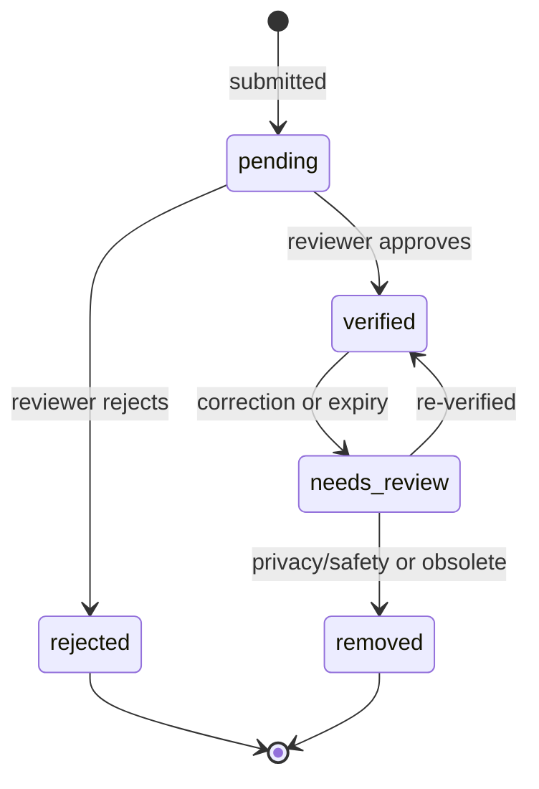

# Data model and API

> Field-by-field public reference: see the
> [data dictionary](DATA_DICTIONARY.md). Export releases: see the
> [export versioning policy](EXPORT_VERSIONING.md).

## Public camera record

| Field | Public? | Description |
| --- | --- | --- |
| `id` | Yes | Stable record identifier |
| `title` | Yes | Plain-language label; no personal names |
| `kind` | Yes | Camera category, for example fixed dome or traffic monitoring |
| `latitude`, `longitude` | Yes, rounded where necessary | Location of publicly visible infrastructure |
| `address` | Usually | General location text, not a private address |
| `description` | Yes after review | Brief factual context, without sensitive operational detail |
| `manufacturer` | Only with a field-specific opt-in | Optional maker/brand supplied with a report; stays private unless a moderator explicitly elects to publish this field |
| `observedOn` | Only with a field-specific opt-in | Optional ISO calendar date of the observation; stays private unless a moderator explicitly elects to publish this field |
| `source` | Yes | Provenance type such as survey, official source, or demo |
| `updated` | Yes | Last public verification date |
| `status` | Yes in controlled form | `verified` or `demo`; `pending` is never public |

## Fields planned for moderated storage

- Optional report metadata: `manufacturer` and `observedOn`. Intake
  normalises the manufacturer text and accepts the observation date only in a
  valid calendar-date form. Both fields belong to the private pending report
  first; neither is made public merely because it was submitted or because the
  camera record is approved.
- Per-field publication choices: `publishManufacturer` and `publishObservedOn`
  default to `false`. A moderator makes each choice independently during a
  camera decision. The public query and every export suppress the underlying
  value unless its own flag is `true`.
- Submission timestamp and contributor reference (pseudonymous internal ID where possible).
- Review decision, reviewer ID, reason code, and decision time.
- Correction/takedown requests and resolution state.
- Evidence references held separately from public record data.
- Change history and confidence indicator.

Exact schema fields should be approved by privacy review before collecting them.

## Status lifecycle

Only `verified` records are eligible for real public publication. `demo` is reserved for fictional, clearly labelled prototype content.

When a moderator approves a report, approval is not a blanket publication of
every submitted field. Optional `manufacturer` and `observedOn` metadata each
have an independent publication choice, defaulting to private. A moderator
sets `publishManufacturer` and/or `publishObservedOn` only after confirming
the individual value is sufficiently accurate, relevant, and safe under the
applicable data-minimisation policy. A false flag suppresses the raw value from
JSON, CSV, GeoJSON, map, directory, and record-detail output.

## Existing prototype endpoints

| Method | Route | Behaviour |
| --- | --- | --- |
| `GET` | `/api/cameras` | Returns public `verified` and `demo` records |
| `GET` | `/api/cameras?format=geojson` | Downloads the same public records as GeoJSON |
| `GET` | `/api/cameras?format=csv` | Downloads the same public records as CSV |
| `POST` | `/api/cameras` | Normalises optional `manufacturer` text, validates an optional `observedOn` date (`YYYY-MM-DD`), then creates a private `pending` report after basic validation |

The POST route has no production identity, rate limiting, image handling, or reviewer interface. It must not be exposed for real public submissions until those controls exist.

## Local report-location selection

The local report form accepts a position chosen by clicking the map or by
entering a valid latitude and longitude. Both interactions use the same
validated `latitude`/`longitude` submission fields and trigger the same
non-blocking nearby check. That check draws only from `verified` and fictional
`demo` records; it does not expose pending submissions or other private data.

## Data quality rules

- Every published record needs provenance, a review decision, and an update date.
- Prefer a precise coordinate only when its publication is safe; otherwise round or generalise it.
- Use controlled categories rather than free-form surveillance capability claims.
- Treat “brand”, “direction”, “coverage”, and similar fields as potentially sensitive; their public availability requires a jurisdiction-specific rule.
- Retire or mark stale records rather than presenting old observations as current facts.
