# ADR 0021: Community-driven pivot — immediate publication, community actions, automatic state transitions

- **Status:** accepted (CEO decision, 2026-08-04)
- **Date:** 2026-08-04
- **Author:** Grace (QA), recording the CEO decision of 2026-08-04
- **Decision owner:** CEO (Simone) — 2026-08-04: "il sito diventa tutto in base a
  segnalazioni: utenti aggiungono, segnalano telecamere che non ci sono più, danno
  mi piace alle più utili — TUTTO SENZA moderazione manuale, SOLO utenti registrati"
- **Updates:** ADR 0001 (public data boundary — new reports publish immediately,
  the pending→verified human review queue is retired for the normal flow);
  ADR 0009 (reviewer roles and moderation queue — the queue survives only for
  legal-emergency admin actions; normal flow is automatic); ADR 0014 (appeals —
  the contrary-consensus mechanism replaces the human appeal workflow; pending
  appeals are closed by migration, history preserved); ADR 0018 (community
  verifications and trust levels — `camera_confirmations` evolves into
  `camera_community_actions`, the level-0 403 fail-closed gate becomes a reduced
  weight, and the level counter's status predicate changes from `verified` to
  `active`)
- **Related ADRs:** 0013 (contributor accounts and sessions), 0019 (pre-submit
  duplicate confirmation gate — unchanged), 0020 (multi-method authentication —
  the verified-account write gate is **unchanged** and remains the identity
  choke-point for every community action)
- **Related docs:** `docs/COMMUNITY_PLAN.md` (roadmap superseded for the
  moderation model), `docs/DATA_MODEL.md` (status lifecycle diagrams),
  `docs/MODERATION.md`, `docs/TERMS_OF_USE.md`, `docs/legal/PRIVACY_NOTICE.md`,
  `docs/legal/RETENTION_SCHEDULE.md`

## Context

The CEO has pivoted the product: the site becomes a fully community-driven
directory. Users add reports, flag cameras that are no longer present, and mark
the most useful ones — **with no manual moderation and no pending queue**.
Every report publishes immediately; the community, not a reviewer, keeps the
directory accurate.

Today the opposite is true (ADR 0001, 0009): reports enter as `pending`, a
human reviewer approves or rejects them, and only `verified` (plus local `demo`)
records are public. A published record carries a moderator's signature. That
model cannot satisfy the pivot, and its machinery — `moderation_queue`,
`moderation_appeals`, the reviewer role matrix — is more process than the new
product wants.

The pivot must keep the parts of the system the CEO explicitly preserves and
that the project depends on:

1. **Identity and write gate (ADR 0020) are unchanged:** every write already
   requires a verified contributor account (`resolveVerifiedContributor`: 401
   anonymous, 403 not-yet-verified). Community actions ride the same gate.
2. **Trust levels (ADR 0018) are reused as the weighting primitive** for
   thresholds, with new accounts weighing less instead of being blocked.
3. **The append-only audit trail (`moderation_events`) stays** as the internal
   audit layer; the new requirement is a *public* per-record event history
   (transparency) with no actor attribution (identification risk — ADR 0018 § 6).
4. **The duplicate gate (ADR 0019)** and the two-identity separation
   (contributors vs users/reviewers, ADR 0018 § 1) are untouched.

## Decision

### 1. Immediate publication — no pending queue for new reports

1. A new report created by a verified contributor is inserted directly with
   `status = 'active'` and is **public immediately** (list, map, GeoJSON,
   record page). There is no `pending` state for new submissions.
2. The write gate stays exactly as ADR 0020 decision 2: anonymous submission is
   **no longer possible** (already superseded for writes by ADR 0020) and an
   unverified session gets 403. The pre-submit duplicate gate (ADR 0019) still
   runs before insert.
3. `PUBLIC_CAMERA_STATUSES` becomes `["active", "demo"]`. Every public read
   path derives its whitelist from the same constant as today — one change,
   every surface follows.

### 2. State model and transition matrix

Four domain states; `demo` is the technical prototype marker and never part of
the community flow.

| Status | Public? | Meaning |
| --- | --- | --- |
| `active` | Yes | Report is live and listed |
| `hidden` | No (direct link with banner) | Present but withdrawn pending community/legal consensus — **reversible** |
| `removed` | No (direct link with banner) | Community agrees it is no longer there (or admin legal removal) — **reversible** |
| `demo` | Local prototype only | Fictional seed data, never in production |

`hidden` is a **new** status: today hiding a record means `removed` (terminal,
DATA_MODEL.md). The pivot separates "still there but withdrawn" (`hidden`,
privacy/problem) from "gone" (`removed`) because they have different reversal
paths.

```mermaid
stateDiagram-v2
  [*] --> active: report submitted (verified contributor)
  active --> hidden: problem sum ≥ 3 (≥2 distinct) OR privacy action ≥ 1 OR admin legal emergency
  active --> removed: gone sum ≥ 3 (≥3 distinct) OR admin legal emergency
  hidden --> active: contrary consensus (confirm sum ≥ 5, ≥3 distinct); privacy hides also require cooldown elapsed
  hidden --> removed: gone sum ≥ 3 (≥3 distinct) while hidden
  removed --> active: contrary consensus (confirm sum ≥ 3, ≥2 distinct)
  demo --> [*]
```

1. **Every transition is an event** (decision 7): the trigger threshold, the
   counts that met it, and the timestamp are recorded publicly, and the
   transition is a single atomic D1 write (status update + event insert + action
   consumption).
2. **No transition happens on a timer.** The old freshness sweep
   (`verified → needs_review → stale`) is retired; nothing changes status
   without community (or admin-legal) action.
3. **Action consumption.** When a threshold triggers a transition, the actions
   of the triggering type are deleted ("consumed") so the state change is
   stable until new consensus forms — a record cannot flip back and forth on the
   same stale actions. Consumed counts are preserved in the transition event.

### 3. Community actions — one action per user per record

New table `camera_community_actions`
(`id, camera_id FK CASCADE, contributor_id FK CASCADE, action_type, weight,
created_at, updated_at`) with **`UNIQUE(camera_id, contributor_id)`** — the
structural anti-gaming layer: one active action per (record, contributor),
enforced at the database level (pattern of ADR 0018 `camera_confirmations`).

Five action types (whitelist, `CHECK` constraint):

| Action | Effect | Feeds |
| --- | --- | --- |
| `like` | Useful signal | Ranking score |
| `confirm` | "Still present" — refreshes `last_verified_at` | Freshness + reversal consensus |
| `gone` | "No longer there" | `removed` threshold |
| `problem` | "Something is wrong with this record" | `hidden` threshold |
| `privacy` | Privacy/legal concern | `hidden` threshold (low, non-weighted) |

1. **Verified account required for every action** — write gate ADR 0020
   unchanged (`resolveVerifiedContributor`: 401 / 403). No anonymous actions.
2. **One action per user per record.** `PUT /api/cameras/[id]/actions`
   (body `{ action }`) upserts:
   - same action already active → **409** (pattern ADR 0018 toggle);
   - different action active → the row is **switched** (200; the old action's
     counts stop, the new one's start). The switch is an **internal** audit
     event (`action-changed` in `moderation_events`); the public history only
     ever sees aggregate counts (decision 7, no attribution);
   - `DELETE` removes the action (200 / 404 without a row);
   - `GET` returns the caller's personal state (no-store).
3. **Self-action gate:** a contributor cannot `like` or `confirm` their own
   record (**403**, autoreferential signal, ADR 0018 self-verification
   pattern). Self-`gone`/`problem`/`privacy` **are allowed**: "I removed my own
   camera" and "this is my own data, hide it" are legitimate, and
   self-privacy gives a GDPR-friendly fast hide of one's own record.
4. **Weight is a snapshot.** `weight` is computed from the contributor's trust
   level **at action time** and stored on the row. Later level changes never
   rewrite history, so thresholds stay deterministic and auditable.
5. **Aggregates only in public payloads:** counts and scores are `SUM`/`COUNT`
   over active actions — never attribution to any profile (ADR 0018 § 2.3).
   `last_verified_at` is refreshed on every `confirm` upsert (a switch away from
   `confirm` does not undo a refresh already granted).

### 4. Weights and thresholds — trust-weighted, all tunable

Default weights per trust level (ADR 0018 `deriveLevel`), stored in config:

| Level | Weight |
| --- | --- |
| L0 (new, email-verified) | 0.25 |
| L1 | 1 |
| L2 | 2 |
| L3 | 3 |
| L4 | 5 |

1. **`gone` → `removed`:** weighted sum ≥ **3** AND ≥ **3 distinct**
   contributors. A single powerful account can never remove a record alone
   (min-distinct floor); a dozen new accounts (0.25 × 12 = 3) can — the
   threshold is reachable by the community, not only by veterans.
2. **`problem` → `hidden`:** weighted sum ≥ **3** AND ≥ **2 distinct**
   contributors. Lower distinct floor than `gone` because hiding is less
   destructive than removal and is fully reversible.
3. **`privacy` → `hidden`:** **1 action** (non-weighted, min-distinct 1) — the
   single deliberately aggressive case the CEO requested ("soglia BASSA 1-2 →
   nascosto subito prudenziale"). Prudential: a verified account can withdraw a
   possibly privacy-violating record immediately; reversal requires the high
   bar of decision 6. Abuse cost is bounded by email verification (creating
   verified accounts at scale is expensive) and by the reversal cooldown.
4. **Reversal (contrary consensus):**
   - `removed → active`: confirm sum ≥ **3**, ≥ **2 distinct** ("it is still
     there" beats "it is gone").
   - `hidden → active`: confirm sum ≥ **5**, ≥ **3 distinct** — and, when the
     hide reason is `privacy`, only after the cooldown
     `PRIVACY_HIDDEN_COOLDOWN_DAYS` (**default 7**) has elapsed since the hide.
     The asymmetry (5/3 + cooldown vs 3/2) keeps the aggressive privacy path
     from being flip-flopped on the same day.
5. **Threshold evaluation** is a single indexed query over active actions of
   the triggering type (`GROUP BY` + `COUNT(DISTINCT contributor_id)` +
   `SUM(weight)`); no denormalised counters (ADR 0018 § 3.3 pattern).

### 5. Tunable configuration — no deploy

1. New table `community_settings` (`key TEXT PRIMARY KEY, value TEXT JSON,
   updated_at`) with code defaults as fallback. Every threshold, weight, quota
   and cooldown above is a key:
   `weights.byLevel`, `thresholds.gone`, `thresholds.goneMinDistinct`,
   `thresholds.problem`, `thresholds.problemMinDistinct`,
   `thresholds.privacy`, `thresholds.restoreFromRemoved`,
   `thresholds.restoreFromHidden`, `thresholds.restoreMinDistinct*`,
   `cooldown.privacyHiddenDays`, `quotas.actionsPerDay`,
   `quotas.actionsPerDayTrusted`, `quotas.perRecordPerDay`,
   `rateLimit.actionPerMinute`.
2. Read path: one D1 point-read per evaluation with a 60 s in-process cache —
   changes apply within a minute, no deploy, no restart.
3. Write path: `GET/PATCH /api/admin/community-settings`, admin-only (edge
   gate, ADR 0014 role model), every change appends a `moderation_events` row
   (`setting-changed`, with the diff) — the audit trail covers tuning too.

### 6. Reversibility — every transition is a tracked, reversible event

1. Every state transition writes: a public `camera_lifecycle_events` row
   (decision 7) and an internal append-only `moderation_events` row (existing
   trigger-protected trail).
2. Reversal is always **contrary consensus** (decision 4.4), never a
   single-user undo and never an admin restore: the only human write power left
   is the legal emergency hide (decision 8), which is itself reversible by
   consensus after the cooldown.
3. A hidden/removed record remains reachable by direct link, with an explicit
   banner ("record hidden — pending community verification" / "reported as no
   longer present"), so the reversal signals (`confirm`, `gone`) can still be
   cast by those who saw it, while it stays out of directory, map, search and
   GeoJSON.

### 7. Transparency — public per-record event history; moderation and appeals recycled into it

1. New public table `camera_lifecycle_events`
   (`id, camera_id FK, event_type, detail TEXT NULL, created_at`), served by
   `GET /api/cameras/[id]/events` (`Cache-Control: s-maxage=300,
   stale-while-revalidate=600`).
2. **No actor attribution, ever.** Event types are semantic and aggregate:
   `published`, `confirmed` (count), `liked` (count), `gone-flagged`,
   `hidden` (reason: `problem | privacy | admin-legal`, counts),
   `removed` (counts), `restored` (counts), `action-consumed`,
   `migration`, `setting-changed` (admin-only surface, not in the public list).
   Public rows never carry contributor ids, emails, or IP-derived data.
   Identification risk is the same reason ADR 0018 § 3.4 keeps levels private.
3. **Moderation and appeals are recycled into this history, not deleted.** The
   old human decisions (`approve`, `reject`, `hide`) and appeal outcomes are
   backfilled as historical `migration` events without attribution; the
   `moderation_queue` / `moderation_appeals` tables are retired for the normal
   flow but their rows stay for record (migration plan below).
4. The audit trail (`moderation_events`, append-only, trigger-protected) keeps
   full attribution internally; the public history is its projection without
   identity. The two never mix on the wire.

### 8. Residual human moderation — legal emergency only

1. The **only** remaining human write action is the administrator's legal
   emergency hide/removal (`hide` / `remove` with mandatory reason code,
   ADR 0009 emergency pattern, single-person by design and reviewed
   retrospectively). It produces a public `hidden`/`removed` event with reason
   `admin-legal`.
2. Administrators cannot restore or un-hide unilaterally (separation: the
   community consensus of decision 6 is the only reversal path, so no single
   account — human or not — controls publication).
3. The reviewer role matrix (ADR 0009) stays defined for this residual surface;
   intake/record reviewers have no normal-flow duties anymore. Roles are not
   deleted in the schema (history, provisioning), only unused.

### 9. Freshness — community-confirmed, not scheduler-driven

1. `last_verified_at` is refreshed by every `confirm` action (decision 3.5).
   The record page and directory show the last-confirmed date; a record with
   `last_verified_at` older than its review interval shows a neutral
   "last confirmed X" badge — **information, never a state change**.
2. The freshness sweep (`verified → needs_review → stale`) and the
   `needs_review`/`stale` statuses are retired; `review_due_at` /
   `review_interval_months` stay as informational metadata only.
3. A record that nobody confirms stays `active` forever unless the community
   says otherwise (`gone`). Accuracy is the community's job, at its own pace.

### 10. Ranking — weighted usefulness

1. Ranking score = `SUM(weight)` over active `like` actions (query-time, one
   indexed `GROUP BY`); `GET /api/cameras?sort=useful` orders by it.
2. Public payloads expose `usefulCount` (distinct likers — a human number) and
   never the raw weighted score (ADR 0018 § 3.4: the numeric weight is never
   exposed; not gaming-designable).
3. Sort options: `useful | recent | confirmations` (the last orders by
   `last_verified_at`, so actively confirmed cameras surface).

### 11. Anti-gaming — consolidated

1. **Structural UNIQUE** `(camera_id, contributor_id)` — one action per user
   per record at the DB level; switch is an event-tracked update.
2. **Write gate** — every action needs a verified account (ADR 0020): bulk
   sockpuppetry requires verified emails at scale.
3. **Weights** — new accounts weigh 0.25; a removal needs ≥ 3 distinct people
   (decision 4).
4. **Daily quotas** (D1 state count inside the write transaction, ADR 0018
   pattern): `quotas.actionsPerDay` (20; 40 trusted) → 429 + Retry-After;
   per-record cap 5 actions/day from distinct accounts → 429.
5. **IP-hash bucket** — N accounts from the same IP in a burst trip the
   existing bucket + surge alert with `callerHash` (never raw IP; NAT/CGNAT →
   soft-flag, ADR 0018 § 5.4 pattern).
6. **Consumption** — trigger actions are consumed on transition; stale actions
   cannot re-trigger.
7. **Privacy-path bounded abuse** — aggressive hide is cheap, so reversal is
   expensive (5/3 distinct + 7 d cooldown) and re-hide by the same account is
   just another 1-action hide; the operator tunes
   `thresholds.privacy` to 2 if abuse materialises (no deploy).

### 12. Trust levels — count over `active`

1. `deriveLevel`'s counter changes predicate from `status = 'verified'` to
   `status = 'active'` (migration backfills nothing: levels are recomputed on
   read, ADR 0018 § 3.2 — the count query and the `(contributor_id, status)`
   index serve `active` as well).
2. Bidirectionality is preserved: a record that the community removes (`gone`)
   or hides permanently stops counting, and the contributor's level drops —
   the anti-farming property of ADR 0018 § 3.5.3.
3. The level-0 **403 fail-closed** gate for verifications (ADR 0018 § 2.2.5) is
   superseded: new accounts act with weight 0.25 instead of being blocked. The
   email-verification write gate (ADR 0020) is the only hard gate left.

### 13. Erasure (GDPR art. 17) extends to the new tables

1. `eraseContributor()` (db/auth.ts) also deletes the contributor's
   `camera_community_actions` rows (their own data, art. 17) in the same atomic
   D1 batch. Their actions on others' records disappear with them; counts and
   thresholds are recomputed live, so an erased account's influence ends.
2. Transitions that already happened stay in history (aggregate, unattributed —
   no personal data in `camera_lifecycle_events`), exactly as moderation
   history survives today.
3. Legal basis unchanged: art. 6(1)(f) for all community mechanics (ADR 0018
   § 6.3); the public event history is a transparency control of the controller,
   not a new collection of personal data (aggregates only).

## Data migration plan (existing data → new model)

All in one hand-written migration set (Drizzle journal idx 36–39, pattern
ADR 0009/0018: `drizzle/00NN_*.sql`), shipped before the schema PR:

| Current status | New status | Notes |
| --- | --- | --- |
| `pending` | `active` | Published retroactively — the pivot's whole point; the community corrects accuracy from day one. `last_verified_at` stays NULL (never verified) → "never confirmed" badge. |
| `verified` | `active` | Straight rename; `last_verified_at` kept. |
| `needs_review` | `active` | Back on the public surface with an aged-verification badge (decision 9.1). |
| `stale` | `active` | Same as `needs_review`. |
| `rejected` | `removed` | Never public; preserved as `removed` (reversible by consensus — the old rejection is no longer terminal). |
| `removed` | `removed` | Unchanged. |
| `demo` | `demo` | Unchanged; excluded from the community flow. |

> Side effect, documented and intended: `pending` records migrated to `active`
> start counting toward their contributor's trust level immediately (decision
> 12.1 — the level predicate becomes `status = 'active'`). Contributors with
> reports stuck in the old queue see their level rise on migration day; the
> `migration` event makes it auditable.

Steps:

1. **0036 — `camera_community_actions`**: create table + UNIQUE + CHECK +
   indexes (`(camera_id, action_type)`, `(contributor_id, created_at)`).
2. **0037 — `community_settings`**: create + seed defaults (the exact numbers in
   decision 4/5, so config and code agree at first boot).
3. **0038 — `camera_lifecycle_events`**: create table + index `(camera_id,
   created_at)`.
4. **0039 — data migration** (single transaction, idempotent):
   a. Map `cameras.status` per the table above; write one `migration` event per
      affected record (old status, new status) into `camera_lifecycle_events`;
      write the equivalent internal `moderation_events` rows.
   b. **`camera_confirmations` → `camera_community_actions`**: insert every row
      as `action_type='confirm'` with `weight` = the contributor's level weight
      **at migration time** (snapshot rule, decision 3.4); then drop
      `camera_confirmations` (its UNIQUE is superseded by the new one).
   c. **Appeals**: pending `moderation_appeals` → `dismissed` with a
      `migration` event (the contrary-consensus mechanism replaces the appeal
      flow; nothing is deleted — history preserved, ADR 0014 rows kept).
   d. **Queue**: open `moderation_queue` rows → `closed` with a `migration`
      event (no reviewer duties in the normal flow).
   e. **Backfill public history** from `moderation_events` (existing decisions
      on cameras): map actions to semantic events (`approve → published`,
      `reject → removed`, `hide → hidden` with reason `admin-legal`), **no
      attribution**.
   f. **Freshness sweep disabled**: the scheduler no longer invokes the
      `verified → needs_review → stale` path; `evaluateFreshness` stays for the
      informational badge only.
5. Post-migration smoke (QA gate, same PR): counts match before/after
   (`cameras` by status, confirmations vs actions), zero `pending`/
   `needs_review`/`stale`/`rejected` remain, zero open queue/appeal rows, event
   backfill count equals migrated moderation decisions.

## Follow-up phases — endpoints and tables for the CEO's implementation tasks

**New tables** (migrations 0036–0038): `camera_community_actions`,
`community_settings`, `camera_lifecycle_events`. Dropped: `camera_confirmations`.

**New / changed endpoints** (each a phase task; write gate and CSRF on every
write, no-store on personal state):

| Endpoint | Phase | Notes |
| --- | --- | --- |
| `PUT /api/cameras/[id]/actions` | Community actions | body `{action}`; 200 switch / 409 same / 403 self+like-confirm / 401/403 gate; quota 429 |
| `DELETE /api/cameras/[id]/actions` | Community actions | 200 / 404 |
| `GET /api/cameras/[id]/actions` | Community actions | personal state, no-store |
| `GET /api/cameras/[id]/events` | Transparency | public lifecycle history, cache 300/600 |
| `GET /api/cameras?sort=useful\|recent\|confirmations` | Ranking | weighted score ordering, `usefulCount` exposed |
| `GET/PATCH /api/admin/community-settings` | Config | admin-only, edge gate, audit diff |
| Removal of `PUT/DELETE/GET /api/cameras/[id]/confirmation` | Cleanup | superseded by `actions` (or kept as alias for one release — CEO choice) |
| `POST /api/cameras` change | Immediate publication | insert `status='active'`, no queue row |

**UI/routes** (design phase): action widget on `/records/[id]` (one active
action, disabled states for gate/self), public "history" panel per record,
hidden/removed banner + direct-link access, directory sort control, admin
settings page. Terminology frozen (i18n parity EN/IT, ADR 0007): "useful /
utile", "confirm / confermo ancora presente", "no longer there / non c'è più",
"flag / segnala", "hidden / nascosto" — never stars/upvotes/rank.

## Consequences

- **Product**: the directory becomes live-editable by verified users; accuracy
  and freshness are community-driven; zero-touch publishing removes the review
  bottleneck.
- **Quality trade-off**: a bad report is public until the community flags it.
  Mitigations: verified-account gate, low privacy threshold, consumption +
  reversal, public history. This is the cost of the CEO's explicit "no manual
  moderation" — accepted.
- **Legal**: the controller remains accountable (art. 5(2)); automatic
  safeguards (privacy threshold, public history, erasure) are the control
  mechanisms. PRIVACY_NOTICE, TERMS_OF_USE, MODERATION.md, DATA_MODEL.md and
  COMMUNITY_PLAN.md must be updated (separate legal phase); the residual admin
  emergency power is documented in MODERATION.md.
- **Operations**: no reviewer duties in the normal flow; the admin emergency
  surface stays (ADR 0009 roles intact, unused); operators tune thresholds via
  the settings endpoint, audited.
- **QA**: test matrix for the implementation phases — threshold math (weighted
  sums, min-distinct floors), consumption/reversal cycles, privacy cooldown,
  migration mapping (statuses, confirmations, appeals, queue), self-action and
  gate 401/403, quotas 429, event history no-attribution, erasure of actions,
  `sort=useful` ordering.
- **Schema**: migrations 0036–0039, hand-written + journal/snapshot, next free
  index after 0035.
- **Trade-offs accepted**: old `pending` reports are published without review
  (the pivot's intent, but a one-time exposure event — mitigated by the privacy
  threshold being active from day one); `rejected` records become reversible
  (the old "no" is no longer final); a single verified account can hide a record
  for privacy (aggressive by CEO design, bounded by reversal cost and
  tunability); `camera_confirmations` is dropped (its history is preserved in
  the migrated actions + events).

## Alternatives

- **Post-publish sampling moderation** (review a % of new reports): rejected —
  still human moderation, which the CEO explicitly removed.
- **AI-assisted triage before publish**: rejected — no model, no explainability,
  and it reintroduces a queue by another name.
- **Pending with auto-approve after N hours**: rejected — the delay adds nothing
  and contradicts "pubblicazione IMMEDIATA".
- **Unweighted thresholds** (plain counts): rejected — sockpuppet-friendly; the
  CEO asked for trust-weighted thresholds (ADR 0018), and min-distinct + weights
  together give both resistance and reachability.
- **Extending `camera_confirmations` with a `type` column**: rejected in favour
  of a fresh table + migration — the old UNIQUE, semantics and toggle contract
  are confirmation-specific, and a clean table keeps the phase contracts simple.
- **Admin unilateral restore**: rejected — one human would control
  publication, contradicting the community model and the transparency goal.
- **No public event history**: rejected — the CEO asked for
  moderation/appeals to be recycled into a public timeline; without attribution
  it is safe and it is the transparency control of the whole model.
- **Keeping the freshness sweep as a soft warning**: partially adopted —
  informational badge only, never a state change (decision 9).
