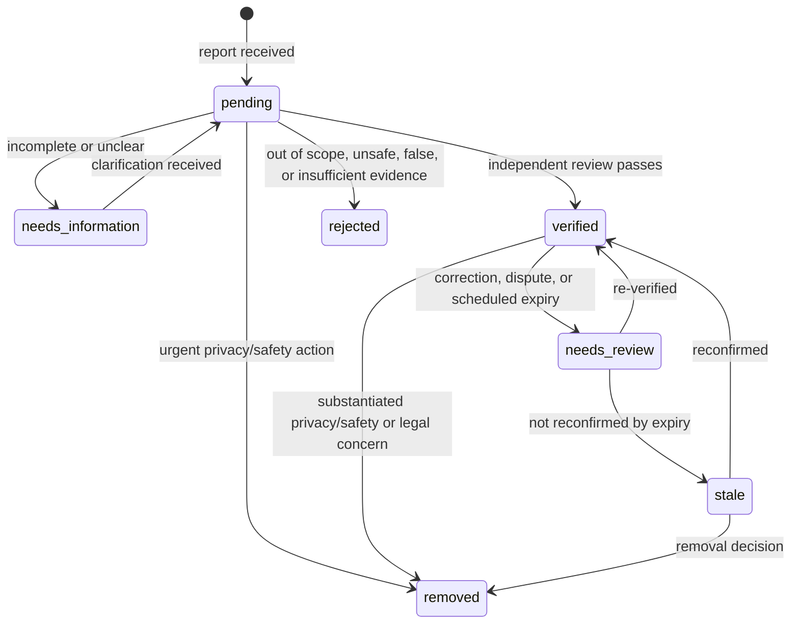

# Data, moderation, privacy, and safety workstream

This workstream turns reports into a trustworthy public dataset without treating
contributors, photographed bystanders, or people affected by a record as data
sources to be exploited. It implements the boundaries in the project-level
[data model](../DATA_MODEL.md), [moderation policy](../MODERATION.md), and
[privacy and safety guidance](../PRIVACY_AND_SAFETY.md).

This is an operational proposal for a limited public alpha, not legal advice.
Each pilot jurisdiction needs a documented local review before real records are
accepted.

## Outcome and boundaries

The public database documents *visible, public-facing surveillance
infrastructure* for civic transparency. It is not a registry of people,
security weaknesses, private property, or live feeds.

The public dataset must never include:

- private residential, doorbell, or inward-facing cameras;
- stream URLs, credentials, network details, maintenance information, or other
  operational/security-sensitive material;
- reporters' identities, raw submissions, moderation notes, or appeal files;
- photographs with unredacted faces, licence plates, private interiors, or
  incidental sensitive information; or
- claims about a camera's capabilities unless supported by an allowed source
  and necessary for the stated public purpose.

## Target record model

One observed camera is one canonical record. A report, a piece of evidence, and
a moderation decision are separate private objects linked to that record. This
prevents a contributor from becoming the public source of truth and preserves
an auditable history without publishing personal data.

| Object | Core fields | Visibility |
| --- | --- | --- |
| Canonical camera record | stable ID, category, safe location, public description, status, confidence, first/last observed, provenance summary | Public only when `verified` or `stale` under the rules below |
| Submission | internal ID, pseudonymous contributor reference, received time, proposed fields, consent/rights assertions | Private |
| Evidence item | source type, capture/URL date where relevant, redaction state, integrity reference, retention deadline | Private by default; only an approved derivative may be public |
| Moderation decision | decision, reason codes, reviewer IDs, timestamps, escalation link | Private audit record; aggregate statistics only are public |
| Change or correction request | request type, affected ID, contact channel, supporting material, outcome | Private, with a public record-level change date where appropriate |

### Public fields

Publish the minimum useful set: stable ID, broad camera category, a reviewed
location (rounded/generalised when needed), neutral description, source class,
confidence tier, last verified date, status, and a non-identifying revision
history. Brand, orientation, coverage, and exact mounting details are optional
and should default to private or omitted unless local policy explicitly permits
them.

### Status lifecycle

`pending`, `needs_information`, `rejected`, and `removed` are never public.
`stale` may be public only with a clear "last verified" label and no claim that
the camera is currently present. A removal hides the record immediately from
public maps, APIs, downloads, and search; the private decision history is kept
only for its retention period.

## Provenance, confidence, and staleness

### Provenance classes

Every public record displays a source class and the date it was last assessed.
It must not expose a reporter's name, email address, account name, or raw
evidence.

| Class | Meaning | Minimum publication condition |
| --- | --- | --- |
| `official_public_source` | Public authority or operator material that may lawfully be cited | Current link/citation captured privately and checked by a moderator |
| `field_observation` | Contributor saw a visible camera in public space | Evidence or a sufficiently detailed report; moderator confirms scope and location |
| `independent_confirmation` | A second independent observation supports a report | Separate contributor or source, not merely a duplicate submission |
| `trusted_partner` | Documented import from a vetted civic/research partner | Written import agreement, field mapping, sample audit, and provenance retained |
| `historical_reference` | A credible past source, not confirmation of current presence | Never enough alone for `verified`; use only with an explicitly stale/historical label if approved |

Imported data retains its original source and licence. A source that is merely
popular, scraped, or anonymous is not automatically trustworthy.

### Confidence tiers

Confidence describes the quality of the current assertion, not the legitimacy
or purpose of the camera.

| Tier | Display | Proposed rule |
| --- | --- | --- |
| `high` | High confidence | Current official source, or two independent recent confirmations including an appropriate field observation |
| `standard` | Confirmed | One recent, reviewable source sufficient for the scoped pilot and no material dispute |
| `limited` | Limited confidence | Plausible but incomplete; keep non-public during alpha unless a local policy explicitly allows a clearly qualified listing |
| `stale` | Needs reconfirmation | Previously verified record past its review date or subject to an unresolved change signal |

Only `high` and `standard` records are public in alpha. Confidence must be
recomputed when a source expires, a correction arrives, or a reviewer changes
the safe precision of the location.

### Review and expiry clocks

The alpha should use conservative default clocks, adjustable after transparency
reporting and jurisdictional review:

- `high`: scheduled recheck at 24 months.
- `standard`: scheduled recheck at 12 months.
- records flagged by a user, authority, or moderator: reviewed promptly and
  moved to `needs_review` immediately.
- records not re-confirmed within 90 days after their scheduled review become
  `stale`; they must not be silently represented as current.

Automated reminders support these clocks but do not constitute verification.

## Moderation workflow

### Roles and separation of duties

| Role | May do | Must not do alone |
| --- | --- | --- |
| Intake reviewer | Triage spam, remove obvious personal data, request clarification, apply urgent temporary hide | Publish a sensitive/disputed record |
| Record reviewer | Assess scope, provenance, data minimisation, and accuracy; approve normal records | Resolve their own conflict of interest or publish their own submission without a second reviewer |
| Senior moderator | Review escalations, reversals, removals, and quality samples; mentor reviewers | Make a final legal determination without the designated external/legal route |
| Privacy/safety lead | Own urgent-harm queue, retention controls, and incident coordination | Override documented governance alone except for temporary emergency action |
| Administrator | Manage access, audit-log integrity, and backups | Edit record content or approve reports as an administrator-only action |

At least two trained people must be available for alpha. All reviewer access is
named, least-privilege, protected by multi-factor authentication, and removed
promptly when a role ends. Reviewers disclose conflicts (for example, a report
about their employer or property) and recuse themselves.

### Queue and decisions

1. **Receive:** store the report privately; acknowledge receipt without a
   promise to publish.
2. **Safety screen:** reject malware, spam, doxxing, private-camera reports,
   raw media with unnecessary personal data, and operational details. Apply an
   urgent hide when a public record is implicated.
3. **Scope and duplication:** determine whether the report concerns eligible
   visible public infrastructure; link it to a candidate canonical record or
   create one.
4. **Verify:** evaluate provenance, date, location precision, and claim-by-claim
   support. Seek a second reviewer for sensitive/disputed cases.
5. **Minimise:** remove unnecessary detail, select the least precise safe
   location, and publish an approved media derivative only if needed.
6. **Decide and log:** approve, request information, reject, mark stale, or
   escalate with structured reason codes and an immutable audit entry.
7. **Maintain:** schedule recheck and watch for correction/removal requests.

Suggested reason codes include `out_of_scope`, `insufficient_evidence`,
`duplicate`, `privacy_risk`, `safety_risk`, `incorrect`, `expired`, and
`legal_review_required`. Free text belongs in private notes and must itself
avoid unnecessary personal data.

### Proposed alpha service levels

These are targets, not promises, and should be published with the alpha scope.

| Queue | Initial response | Target resolution | Escalation |
| --- | --- | --- | --- |
| Ordinary report | 7 calendar days | 30 calendar days | Backlog over 30 days is reported publicly in aggregate |
| Correction | 3 calendar days | 14 calendar days | Record moves to `needs_review` while assessed |
| Privacy/safety removal | 24 hours | Temporary hide within 24 hours; decision within 7 days where possible | Privacy/safety lead immediately |
| Appeal | 7 calendar days | 30 calendar days | Independent senior moderator; no original reviewer as sole decider |
| Security incident affecting submissions/evidence | 24 hours | Incident process begins immediately | Security contact and operations owner |

High-risk records, sensitive facilities, disputes, and reversals require a
second reviewer before publication or reinstatement. Emergency hiding does not
require two reviewers, but it must be reviewed retrospectively.

## Photos, redaction, and retention

Photo upload remains **off** until the following pipeline is implemented and
tested. The alpha may accept text-only reports first.

### Required media controls before enabling uploads

- Contributor affirms they have the right to submit the image and understand it
  may be used only to review a report.
- Files enter private quarantine; they are malware-scanned, type/size limited,
  and never served from the public map by their original URL.
- EXIF and other embedded metadata are stripped from every derivative. The
  system records only the limited provenance data necessary for review.
- A reviewer redacts faces, vehicle plates, addresses, screens, private
  interiors, and other incidental personal/sensitive material before any public
  use. If safe redaction would undermine the image or be uncertain, do not
  publish it.
- Public display uses a separately stored, redacted derivative with a new opaque
  identifier; originals are access-restricted and logged.
- Reviewers can withdraw an image from public use immediately without deleting
  the associated canonical record where the text evidence remains sufficient.

### Retention proposal

| Material | Default retention | Notes |
| --- | --- | --- |
| Rejected/spam report | 30 days after decision | Shorter where no investigation or abuse-control need remains |
| Pending ordinary report | 90 days after last action | Delete if not resolved or clarified, unless a documented escalation requires more time |
| Original uploaded evidence | 30 days after final decision | Retain longer only for a documented appeal, security, or legal-preservation requirement |
| Redacted evidence supporting a public record | Until next review, then reassess | Delete when no longer needed to support the record |
| Public canonical record and minimal revision history | While the record remains justified, then archive/delete per published schedule | Never retain merely for convenience |
| Moderation audit entry | 24 months after final action | Minimise fields; restrict access; review need annually |

Retention must be configurable by jurisdiction, documented in the public
privacy notice, and enforced by deletion jobs plus periodic audits. Legal hold
is exceptional, documented, access-restricted, and never a blanket reason to
retain all submissions.

## Corrections, removals, and appeals

Every published record has a reachable, low-friction **Report an issue** path.
No account is required for an initial correction or removal request. The form
offers: inaccurate location/details, no longer present, private/non-public,
privacy concern, safety concern, rights/ownership concern, and other.

1. Acknowledge the request using a case ID; do not expose the requester to the
   contributor or reviewers.
2. For credible privacy or safety concerns, immediately hide the record and
   associated public media while reviewing it.
3. Assess the request against provenance, scope, and minimisation rules; request
   only necessary supporting information.
4. Correct, generalise, mark stale, remove, or keep the record with a recorded
   reason. Publish a non-identifying change date when the public record changes.
5. Offer an appeal if the requester disagrees. A senior moderator who did not
   make the original decision reviews the appeal; sensitive cases require a
   second independent reviewer or the documented escalation route.
6. Inform the requester of the outcome and the project contact for unresolved
   process concerns. Do not reveal confidential evidence or reviewer identity.

An appeal process corrects project decisions; it is not a mechanism for
automatically removing accurate, in-scope public-interest records. Conversely,
the project should favour temporary caution where a credible harm report cannot
be resolved quickly.

### Appeal standing and abuse control

Appeals are a channel for people affected by a decision, not a general
dispute queue (audit t_2ee58c08, P3):

- An appeal must state **why the appellant is affected**: they submitted the
  contested report, or they have direct, specific knowledge relevant to the
  record (for example, a field observation of the same camera). The submission
  form requires a reason of at least 20 characters and the senior moderator
  evaluates the stated relevance when deciding; appeals without a substantive
  reason are rejected at submission, and out-of-context appeals are dismissed.
- **Anonymous submissions have no attribution**, so standing cannot be checked
  against them: any contributor may appeal a decision on an anonymous
  submission, on the assumption that they may be the anonymous reporter. This
  is deliberate — it keeps the correction channel open to people who reported
  without an account.
- A **per-appellant threshold** (default 5 appeals per 24 hours, tunable via
  `APPEAL_APPELLANT_RATE_LIMIT_MAX` / `APPEAL_APPELLANT_RATE_LIMIT_WINDOW_SECONDS`)
  bounds sustained filing by one account, on top of the per-IP HTTP bucket.
  Only appeals that actually land on the queue count; failed attempts (unknown
  decisions, duplicates) do not. This prevents a single account from flooding
  the senior-moderator queue with appeals on decisions it has no standing to
  contest.
- If the product later adopts hard ownership checks for attributed submissions
  (rejecting appeals by a non-attributed contributor with a dedicated
  "not my submission" flow), this rule is superseded for attributed records
  only; anonymous submissions remain appealable by anyone.

## Threat and abuse checklist

The following controls are alpha prerequisites or explicit blockers.

| Risk | Control/check |
| --- | --- |
| Doxxing or reports about private homes | Automated and human scope screening; private-address detection; reject/remove policy; emergency hide |
| Exposure of people, plates, or private interiors | Text minimisation; media disabled until redaction workflow is tested; restricted evidence access |
| Stalking, targeting, or tactical misuse | No live feeds, coverage cones, device/network data, or sensitive-site records; safe location precision rules |
| Spam, brigading, or coordinated false submissions | Rate limits (per-IP and per-appellant for appeals), abuse detection, duplicate linking, pseudonymous contributor controls, human publication gate |
| Reviewer harassment or coercion | Pseudonymous public attribution, role separation, private escalation channel, access logging |
| Malicious files or links | Quarantine, malware scan, strict content types, no direct rendering of originals, safe link handling |
| Data scraping or re-identification | Publish only minimised data; documented API limits; no unpublished endpoints; monitor anomalous access |
| Accidental leak of pending data | Separate public/private queries and storage, access tests, export review, log minimisation, incident playbook |
| Biased or uneven coverage | Source labels, confidence/staleness labels, transparency metrics, periodic sampling across areas |
| Compromised moderator/admin account | MFA, least privilege, revocation procedure, audit logs, backup and recovery test |
| Unsafe automated import | Staged import, licence/provenance check, sample audit, no direct publication path |
| Legal or jurisdictional conflict | Narrow pilot scope, named contact, documented escalation, local review before collection |

Quarterly tabletop exercises should test a privacy removal, a leaked pending
record, coordinated false reports, and a compromised reviewer account. Findings
and non-sensitive remediations belong in aggregate transparency reporting.

## Public-alpha go/no-go gate

The data workstream recommends **go** only if every item below has a named
owner and verifiable evidence:

- [x] Pilot geography and eligibility/exclusion rules are approved after local
  privacy/legal review ([ADR 0010](../decisions/0010-pilot-jurisdiction-languages-eligibility.md),
  CEO decision 2026-07-31; Italian GDPR review coherent with the existing
  `docs/legal/` drafts; the boundary applies to the Comune di Ferrara launch
  area — expansion to further municipalities requires a new documented decision).
- [ ] Real reports are private by default; the public API, map, exports, search,
  caches, and logs cannot expose pending material.
- [ ] Record, submission, evidence, decision, and correction objects are
  separated with access controls and audit logging.
- [ ] Provenance classes, confidence tiers, safe location precision, and
  staleness clocks are implemented and visible for public records.
- [ ] At least two trained reviewers plus a privacy/safety escalation owner are
  available for the published alpha hours.
- [ ] The moderation queue supports reason codes, recusal, second review for
  sensitive cases, and emergency hide/removal.
- [ ] A public correction/removal/appeal channel is live and can meet the
  proposed urgent-response target.
- [ ] Photo upload is disabled, or the complete quarantine, redaction, EXIF,
  retention, and access-control workflow has passed a test using non-personal
  test images.
- [ ] Rate limits, abuse controls, MFA for privileged roles, backups, and an
  incident runbook have been tested.
- [ ] Public privacy notice, retention schedule, moderation policy, contact
  details, and aggregate transparency-report format are published.
- [ ] A dry run from submission through review, publication, correction, urgent
  removal, and appeal has succeeded without exposing a test report publicly.

Any unchecked item is a **no-go** for accepting real-world reports. The safe
fallback is to keep the site in demo mode and continue open design work.
